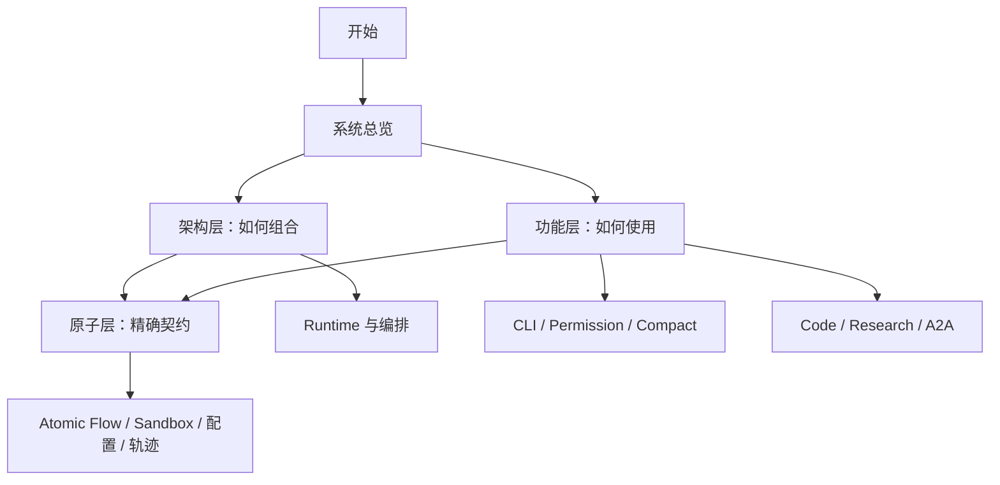

# Yiku 文档

本目录只描述当前实现。文档按架构层、功能层和原子层组织，不按版本、目标态或迁移阶段分类。
源码与文档冲突时，以公开入口和自动化测试为准。

## 阅读路径

首次阅读建议：

1. [系统总览](architecture/system-overview.md)
2. [包边界](architecture/package-boundaries.md)
3. [Runtime 与编排](architecture/runtime-and-orchestration.md)
4. [CLI](features/cli.md)
5. [Permission 与执行边界](features/permissions.md)
6. [Agent-to-Agent 与 Subagents](features/subagents.md)
7. [Atomic Flow](atoms/atomic-flow.md) 与 [Trajectory](atoms/trajectory.md)

## 内容边界

| 位置 | 负责内容 | 不放置 |
| --- | --- | --- |
| `architecture/` | 跨包组合、依赖方向、生命周期和工程不变量 | 单个功能的完整操作手册 |
| `features/` | 用户或宿主可直接使用的能力、配置和失败语义 | 底层协议的逐字段定义 |
| `atoms/` | 基础协议、稳定类型、存储和算法边界 | 具体宿主 UI 与产品流程 |
| `packages/*/README.md` | 包级定位、最小示例和验证命令 | 重复的系统级说明 |
| `superpowers/` | 设计与实施过程记录 | 当前实现的权威说明 |

## 架构层

架构层说明跨包关系、依赖方向、运行生命周期和工程不变量。

- [系统总览](architecture/system-overview.md)
- [包边界](architecture/package-boundaries.md)
- [Runtime 与编排](architecture/runtime-and-orchestration.md)
- [可观测性](architecture/observability.md)
- [工程开发](architecture/engineering.md)

## 功能层

功能层按可使用能力组织操作、公共入口、边界、失败语义和最小示例。

- [CLI](features/cli.md)
- [Code Agent](features/code-agent.md)
- [Research Agent](features/research-agent.md)
- [Agent-to-Agent 与 Subagents](features/subagents.md)
- [Context Compact](features/context-compaction.md)
- [Permission 与执行边界](features/permissions.md)
- [Skills](features/skills.md)
- [Hooks](features/hooks.md)
- [Memories](features/memories.md)
- [Evals](features/evaluations.md)
- [Agent Studio](features/agent-studio.md)

## 原子层

原子层记录基础协议、稳定数据结构、配置存储和底层算法。

- [Atomic Flow](atoms/atomic-flow.md)
- [Atom 目录](atoms/atom-catalog.md)
- [配置与存储](atoms/configuration-and-storage.md)
- [Sandbox](atoms/sandbox.md)
- [Trajectory](atoms/trajectory.md)
- [Flow Graph](atoms/flow-graph.md)

## 能力定位

| 需求 | 文档 |
| --- | --- |
| 启动、参数、Slash Command、非交互输出 | [CLI](features/cli.md) |
| 修改代码和执行命令 | [Code Agent](features/code-agent.md) |
| Workspace 授权、命令审批、Profile、Hook 和 Sandbox | [Permission 与执行边界](features/permissions.md) |
| Shell 进程隔离和平台边界 | [Sandbox](atoms/sandbox.md) |
| Web Search、Evidence、Claim 和报告验证 | [Research Agent](features/research-agent.md) |
| Handoff、Delegate、A2A Envelope、Profile 和 Worktree | [Agent-to-Agent 与 Subagents](features/subagents.md) |
| 自动/手动上下文压缩、摘要和事件 | [Context Compact](features/context-compaction.md) |
| 创建和运行 `SKILL.md` | [Skills](features/skills.md) |
| 生命周期策略与 Trust | [Hooks](features/hooks.md) |
| 长期记忆与召回 | [Memories](features/memories.md) |
| 质量门禁、修复和 Baseline | [Evals](features/evaluations.md) |
| 本地 Web 观测与插件 | [Agent Studio](features/agent-studio.md) |
| Run Event、Replay 和 Fold | [Atomic Flow](atoms/atomic-flow.md) |
| 轨迹生成、更新、存储边界和应用 | [Trajectory](atoms/trajectory.md) |
| Home、Workspace Storage 和配置优先级 | [配置与存储](atoms/configuration-and-storage.md) |

## 维护索引

| 主题 | 主要实现 | 主要测试 | 权威文档 |
| --- | --- | --- | --- |
| Compact | `agent-orchestrator/src/session/compactor.ts`、`agent-orchestrator/src/session/context-budget.ts` | `agent-orchestrator/tests/session/compactor.test.ts`、`agent-orchestrator/tests/session/context-budget.test.ts` | [Context Compact](features/context-compaction.md) |
| Permission | `agents/code/src/permission/`、`cli/src/permission/`、`sandbox/src/` | `agents/code/tests/permission/`、`cli/tests/permission/`、`sandbox/tests/` | [Permission 与执行边界](features/permissions.md) |
| Agent-to-Agent | `agent-orchestrator/src/tools/delegate-tool.ts`、`agent-orchestrator/src/agents/subagent-runtime.ts`、`agent-orchestrator/src/messages/` | `agent-orchestrator/tests/tools/`、`agent-orchestrator/tests/agents/`、`agent-orchestrator/tests/messages/` | [Agent-to-Agent 与 Subagents](features/subagents.md) |
| Memories | `memories/src/`、`agent-orchestrator/src/session/memory-runtime.ts` | `memories/tests/`、Orchestrator Memory Tests | [Memories](features/memories.md) |
| Evals | `evals/src/`、`agent-orchestrator/src/evals/` | `evals/tests/`、Orchestrator Eval Tests | [Evals](features/evaluations.md) |
| Trajectory | `trajectory/src/projection.ts`、`recorder.ts`、`trace.ts` | `trajectory/tests/`、Observatory Trajectory Tests | [Trajectory](atoms/trajectory.md) |

表中的路径都相对于 `packages/`。修改协议字段时，应同时检查生产者、投影适配器、持久化 Schema、
消费者和对应文档；只改 UI 或单个类型通常不足以完成协议演进。

## 文档规则

- 同一主题只有一篇权威文档。
- API 摘要和最小示例放在所属主题中，不单独复制公共导出。
- 当前限制写在所属主题，不保留未来实现方案。
- 不提交单台机器的静态性能结果作为长期事实；保留可复现命令和阈值。
- Package README 只提供包级快速入口，并链接到本目录。
- `docs/superpowers` 是工作过程记录，不属于当前项目文档导航。

## 分享材料

- [Yiku 架构分享页](../artifacts/yiku-architecture-share.html)：面向讲解的交互式摘要；系统事实仍以
  本目录、公开导出和测试为准。
