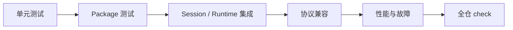

# 工程开发

本文定义 Yiku Monorepo 的开发、测试和发布约束。业务边界见
[包边界](package-boundaries.md)。

## 环境

- Node.js `>=22.13.0`
- `corepack`
- `pnpm`，版本以根 `package.json` 的 `packageManager` 为准

安装：

```bash
corepack pnpm install
```

## 常用命令

```bash
corepack pnpm build
corepack pnpm watch
corepack pnpm lint
corepack pnpm test
corepack pnpm check
```

- `build` 使用 TypeScript Project References，并构建 Agent Observatory Web 资源。
- `watch` 并行启动各正式 Package 的增量 TypeScript 编译。
- `lint` 使用 Biome。
- `test` 使用 Vitest 和 V8 Coverage。
- `check` 顺序运行 lint、build 和 test。

ESLint 和 Prettier 不参与本仓库门禁。

## 代码约定

- 仅使用相对导入，不引入路径别名。
- `index.ts` 只负责导出。
- 前端文件使用小写 kebab-case，函数使用 camelCase。
- 优先使用小模块和局部 `types.ts`。
- Prompt 模板、渲染和 Prompt 专属 UI 归使用它的 Package 所有。
- CLI UI 不进入 Agent 包或 Orchestrator。
- Agent 包不执行 Session。
- 不生成 `.js.map` 或 `.d.ts.map`。
- `packages/cli/bin/yiku.js` 始终启动 `dist/index.js`。

## Package 开发

每个正式 Package 至少提供：

```json
{
  "scripts": {
    "build": "tsc -b",
    "test": "vitest run ...",
    "watch": "tsc -b --watch --preserveWatchOutput"
  }
}
```

新增 Package 时：

1. 配置独立 `tsconfig.json` 和根 Project Reference；
2. 在 `pnpm-workspace.yaml` 中确保路径可发现；
3. 只从 Package `exports` 暴露稳定入口；
4. 使用 `workspace:*` 声明内部依赖；
5. 增加包级 README、测试脚本和 Watch 脚本；
6. 检查依赖方向没有违反包边界。

## 测试结构

正式 Package 测试位于包级 `tests` 并镜像 `src`：

```text
package/
├── src/feature/module.ts
└── tests/feature/module.test.ts
```

前端 Package 的数据和 DOM 测试同样放在 `tests` 的对应镜像目录。测试专用 Fixture 和 Helper
必须留在对应测试目录，生产代码不得依赖测试文件。

测试应覆盖：

- 正常路径和边界输入；
- 类型之外的运行时非法数据；
- 超时、中止和资源关闭；
- 文件系统、网络、Provider 和 Store 故障；
- 并发、幂等和 Revision 冲突；
- 权限、路径、符号链接和数据脱敏；
- 协议序列化、回放与兼容 Fixture。

## 覆盖率

根测试使用 V8 Coverage。语句、分支、函数和行覆盖率均不得低于 90%。纯类型文件和只导出的
`index.ts` 不计覆盖率。

Package 测试不得默认依赖公网、用户配置或现有 Home 数据。需要环境能力时使用临时目录、
Fixture、Fake Provider 或显式注入。

## 分层门禁



- Unit：纯函数、数据结构和错误边界。
- Package：公开 API 与资源所有权。
- Integration：Session、Runtime、Agent、Hook、Memory、Eval 和 Studio 组合。
- Conformance：Hook、Atomic Flow、Store、Schema 和外部兼容协议。
- Performance：预热后使用 P95 和资源上限，不以最快单次结果判断。

## Hooks 兼容门禁

Hooks 兼容基线由 `CLAUDE_HOOKS_COMPATIBILITY_VERSION` 和本地 Manifest/Fixture 定义。当前协议
包含 30 个事件；Runtime 接入 28 个，`WorktreeCreate` 与 `WorktreeRemove` 返回明确的
`HOOK_CAPABILITY_UNAVAILABLE`，不能静默忽略。

变更 Hook 事件、Handler、输出或 Exit Code 行为时，必须依次验证：

1. Schema Fixture；
2. Callback、Command、HTTP、Prompt、Agent 和 MCP Executor；
3. Runtime 生命周期边界；
4. Trust、SSRF、路径、资源上限和脱敏；
5. 无匹配 Hook 的 P95 性能；
6. 全仓门禁。

```bash
corepack pnpm --filter @yiku/hooks test
corepack pnpm --filter @yiku/agent-orchestrator test
corepack pnpm --filter @yiku/cli test
```

## 性能测试

Evals 提供可复现的本地性能脚本：

```bash
corepack pnpm --filter @yiku/evals build
corepack pnpm --filter @yiku/evals performance
```

默认门禁包括：

- 32 Check 调度 P95 小于 100 ms；
- File Store 提交 P95 小于 50 ms；
- 新增 RSS 小于 256 MiB。

结果受 CPU、文件系统和 Runner 影响。CI 应在固定环境维护自己的批准 Baseline，不提交单台开发
机器的静态结果作为长期事实。

## 发布

根 Package 不发布。正式 Package 都使用 ESM 和条件 `exports`，至少提供 `development`、
`types` 和 `import` 入口。发布前执行：

```bash
corepack pnpm check
```

发布检查：

- `dist` 不包含 Source Map 或 Declaration Map；
- 所有公开入口都有生成的 `.js` 和 `.d.ts`；
- 内部依赖版本来自 Workspace；
- README 链接和示例使用公开入口；
- Node.js 最低版本覆盖 `node:sqlite` 等运行时依赖；
- 没有把 `.env`、Home 数据、Session、Memory 或测试临时文件打包。

## 文档维护

`docs` 按架构层、功能层和原子层维护。源码与文档冲突时，以公开入口和测试为准。新增能力时更新
唯一所属主题，不创建按版本、迁移阶段或未来路线分类的重复文档。

新增或拆分正式 Package 时按以下顺序同步：

1. 更新所属的功能或原子文档，明确入口、所有权、失败语义和资源关闭责任；
2. 更新 [包边界](package-boundaries.md) 的直接 Workspace 依赖和边界不变量；
3. 更新 [系统总览](system-overview.md) 的能力地图与主链；
4. 在根 README 和 Package README 保留简短入口，链接到唯一权威主题；
5. 若系统关系或公开分享内容变化，同步 `artifacts/yiku-architecture-share.html`。

分享页是讲解材料，不是新的事实源。仓库指标、Package 数和依赖表必须从当前 Checkout 重新核对，
不能沿用旧快照。
