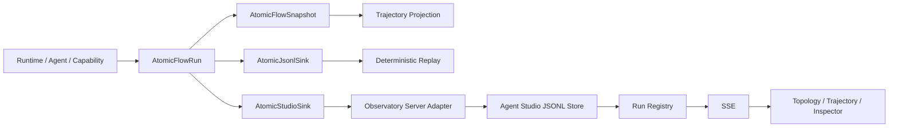

# 可观测性

Yiku 使用 Atomic Flow 记录运行事实，再从同一事件流生成 Trajectory、持久日志和 Agent Studio
视图。执行与观测相互隔离：观测失败会标记降级，但不应停止来源 Agent Run。

## 事实源与投影



约束：

- Atomic Flow Event 是标准 Run 的唯一观测事实。
- Trajectory 不维护第二套执行状态，只从 Event 前缀投影。
- Agent Studio 的 Run Metadata 是可从 JSONL Event 重建的投影。
- UI 状态不反向控制来源 Agent。

## Run 边界

一个顶层 Prompt 对应一个唯一 `runId`。Session 的多个 Stage 共享 Session 身份，但每次顶层提交
使用独立 Run。Run Metadata 包含：

- `kind`：`agent` 或 `control`；
- Session、Agent 和 Prompt 摘要；
- Project ID 与名称；
- 创建时间和当前状态。

Atomic Flow 在单个 Run 内分配严格递增的 Sequence。Atom Key 表示稳定流程节点，Instance ID
表示该节点的一次具体执行。

## Sink

### JSONL

`AtomicJsonlSink` 追加写入完整事件历史。读取后由 `foldAtomicEvents()` 重建 Snapshot。
内部 Sink Receipt 只写一次，避免递归生成观测事件。

### Studio

`AtomicStudioSink` 将 Event 和 Run Metadata 投递到回环 HTTP 端点。它只接受本机地址。投递
失败时：

- 来源 Flow 继续运行；
- Snapshot 标记 `degraded`；
- 添加稳定的降级代码；
- 仅在 `flow.trace: true` 时把 Receipt 和 Sink Error 作为可见 Trace 事件。

## Trajectory

`@yiku/trajectory` 提供静态和实时投影：

- `projectTrajectory(events)`：从 Event 数组生成最终轨迹；
- `observeTrajectory(flow)`：订阅 Flow 生成实时 Snapshot；
- `throughSequence`：投影任意 Replay 前缀；
- Text、Markdown 和 Mermaid Renderer；
- 兼容的 `Trace` 与 `TrajectoryRecorder`。

轨迹保持 Parent/Child、状态、Iteration、摘要和耗时。缺失 Parent 或非法层级会降级为可读根级
步骤，不虚构因果关系。

## Agent Studio

`@yiku/agent-studio` 提供协议无关的服务端和 React 宿主：

- Event Adapter 把外部协议转换为 `StudioEvent`；
- Run Projector 更新状态和扩展数据；
- JSONL Store 与 Run Registry 管理持久历史；
- HTTP API 提供 Health、Manifest、Run 和 Event；
- SSE 推送增量事件；
- 客户端插件贡献 Page、Navigation、Slot、Renderer、Graph、Action 和 Theme Token。

插件依赖、版本和重复贡献在启动时校验。服务端插件 Route 挂载在
`/api/plugins/<plugin-id>/*`。

## Agent Observatory

`@yiku/agent-observatory` 是 Atomic Flow 的默认 Studio 插件。它提供：

- 运行历史与自动跟随；
- Runtime 与领域 Atom Topology；
- Topology/Trajectory 双视图；
- Event Log、Inspector 和消息详情；
- Live、单步与倍速 Replay；
- Agent、Skill、Subagent、Memory、Telemetry 和 Eval 分区；
- 动态 Agent 命名空间；
- `?runId=<id>&view=trajectory` 深链。

`yiku web --port <port>` 启动 Observatory，并在同一终端继续交互会话。终端退出会关闭本次 Web
服务。`yiku web --stop` 只清理已注册的旧后台观察器。

## 图布局

Observatory 使用 `@yiku/flow-graph` 处理端口、障碍物和正交路径。节点业务分区和坐标由
Observatory 决定，路由包只返回几何结果和诊断。显式 Event Edge 优先；缺失时 UI 才使用有限
的相邻事件推导。

## 持久化

Yiku Observatory 的 Run 历史位于：

```text
~/.yiku/workspaces/<workspace>/logs/runs/
```

来源 Atomic Flow JSONL 位于：

```text
~/.yiku/workspaces/<workspace>/logs/atomic-runs/
```

通用 `StudioServer` 在未注入 Store 时使用宿主 `workspaceDir/.yiku/studio-runs`。Yiku CLI
通过 Observatory 插件注入 Home 下的 Workspace Store，因此不会使用项目内默认路径。

## 安全与降级

- Studio Server 默认且只允许绑定 `127.0.0.1` 或 `localhost`。
- Ingest Body 有大小上限，插件 Route 错误返回稳定 Code 和 Request ID。
- SSE 断开后客户端重新获取 Run，再恢复增量订阅。
- 损坏或缺失的兼容 Trace 返回空结果；Atomic JSONL 协议错误则显式失败。
- UI、Sink 或 Renderer 错误不能获得 Runtime 权限。

## 相关文档

- [Agent Studio](../features/agent-studio.md)
- [Atomic Flow](../atoms/atomic-flow.md)
- [Atom 目录](../atoms/atom-catalog.md)
- [Trajectory](../atoms/trajectory.md)
- [Flow Graph](../atoms/flow-graph.md)
