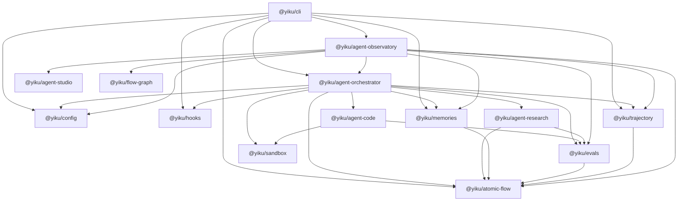

# 包边界

Yiku 把宿主、执行编排、Agent 能力、策略服务、观测协议和展示拆分为独立包。高层包可以组合
低层包，基础协议不能反向依赖 CLI 或具体 Agent。

## 完整依赖方向

图表达正式 Package 的全部 Workspace 生产依赖。当前不存在 Workspace 包循环依赖，也没有未在
`package.json` 声明的生产跨包导入。`@yiku/agent-studio`、`@yiku/atomic-flow`、`@yiku/config`、
`@yiku/flow-graph`、`@yiku/hooks` 和 `@yiku/sandbox` 不依赖其他 Workspace 包。

Observatory 复用 Orchestrator、Memory、Eval 和 Trajectory 的 Atom 定义与投影能力，但这些依赖
不能让 Studio 反向绑定 Yiku 业务协议。

| 包 | 直接 Workspace 依赖 |
| --- | --- |
| `@yiku/cli` | Agent Observatory、Agent Orchestrator、Atomic Flow、Config、Hooks、Memories、Trajectory |
| `@yiku/agent-observatory` | Agent Orchestrator、Agent Studio、Atomic Flow、Config、Evals、Flow Graph、Memories、Trajectory |
| `@yiku/agent-orchestrator` | Agent Code、Agent Research、Atomic Flow、Config、Evals、Hooks、Memories、Sandbox、Trajectory |
| `@yiku/agent-code` | Evals、Sandbox |
| `@yiku/agent-research` | Atomic Flow、Evals |
| `@yiku/evals` | Atomic Flow |
| `@yiku/memories` | Atomic Flow |
| `@yiku/trajectory` | Atomic Flow |
| `@yiku/agent-studio`、`@yiku/atomic-flow`、`@yiku/config`、`@yiku/flow-graph`、`@yiku/hooks`、`@yiku/sandbox` | 无 |

## 代码级组合

包边界之内仍有一层模块级组合。当前实现不是“每个目录一个独立 Primitive”，而是由少数稳定
Primitive 包与一个较大的产品组合根共同完成：

| 包 | 主要内部模块 | 当前组合语义 |
| --- | --- | --- |
| `@yiku/agent-orchestrator` | `runtime`、`session`、`agents`、`skills`、`tasks`、`mcp`、`workspace`、`openai`、`messages`、`evals` | 同时包含执行适配、持久 Session 和 Yiku 默认产品装配 |
| `@yiku/agent-code` | `tools`、`permission`、`prompts`、`models`、`evals` | Code Agent 与可复用代码工具目前共包发布 |
| `@yiku/sandbox` | 平台隔离、启动描述、可用性探针 | 无 Agent 依赖的 Shell 进程隔离 Primitive |
| `@yiku/agent-research` | `evidence`、`tools`、`flow`、`prompts`、`models`、`evals` | Research Agent 与证据原语目前共包发布 |
| `@yiku/cli` | `agent-session`、`app`、`slash-commands`、`permission`、`prompts`、`services` | 宿主 UI 与默认 Runtime 启动装配位于同一包 |
| `@yiku/agent-observatory` | 浏览器 UI、Atomic 投影、Studio 插件、兼容 Server | 默认观测插件与历史兼容入口共包发布 |

`AgentFactoryRegistry` 是当前 Agent 扩展点。未传入 Registry 时，Orchestrator 的 Agent Graph
构建会注册 `CodeAgentFactory` 和 `ResearchAgentFactory`；CLI 的持久 Session 启动也会显式注册
同一组默认 Factory。因此 `@yiku/agent-orchestrator` 当前是带默认业务实现的组合根，不是只含
抽象契约的 Runtime Kernel。

通用 Tool 生命周期契约、Permission、User Question 和 Workspace Access 当前由
`@yiku/agent-code` 定义，再由 Orchestrator 重新导出和消费。这是现有公开 API 的真实所有权，
也意味着一个不使用 Code Agent 的自定义 Orchestrator 宿主仍会安装 Code Agent 包。

## 宿主层

### `@yiku/cli`

拥有 `yiku` 二进制、参数解析、TTY 授权、Ink UI、Prompt 编辑、补全、Slash Command、审批、
时间线和结构化输出。它把执行委托给 Orchestrator，不定义 Agent Runner 或持久 Session 协议。

### `@yiku/agent-studio`

提供协议无关的 Run/Event 模型、JSONL Store、Run Registry、HTTP/SSE Server、React Shell 和
插件贡献点。它不知道 Atomic Flow、Memory、Eval、Trajectory 或具体 Agent。

### `@yiku/agent-observatory`

是 Yiku 的默认 Studio 插件和本地 Web 预设。它把 Atomic Flow 适配为 Studio Event，提供
Topology、Trajectory、Replay、Inspector 和兼容服务端入口。

## 当前宿主接入

当前有三种接入深度：

| 接入方式 | 入口 | 适用范围 |
| --- | --- | --- |
| 单轮 Node 宿主 | `runAgentSession()` | 自动创建并关闭 Session 的兼容入口 |
| 多轮 Node 宿主 | `AgentSession` / `SessionRuntime` | 直接注入 Permission、User Question、Event、Store 和资源生命周期 |
| 低层 Agent 执行 | `AgentFactory` + `run()` | 自行负责配置、Factory、存储、Hook、Memory 和 Eval 装配 |

CLI 通过包内的 `CliAgentSessionContract` 隔离 Ink UI 和具体 Session 实现，但该 Contract 属于
CLI，包含模型切换、Slash Command、导出和管理操作，不是跨 CLI/Web 的公共宿主协议。
Research Playground 直接使用低层 Factory 与 `run()`，自行实现配置加载和结果适配。

CLI 不实现 Agent Graph 的递归构建算法，但当前仍显式注册默认 Code/Research Factory，并读取
Agent Graph 来装配 Hook、Eval 和展示信息。默认 Factory 策略因此同时存在于 CLI 与 Orchestrator；
这是当前组合根重复，不是推荐给新宿主复制的扩展方式。

Agent Observatory 是只读观测 Web，不从浏览器创建、提交或取消 Agent Session。仓库当前没有
一套浏览器安全、传输无关的 Session Command/Event 协议，因此 Web Agent 宿主不能直接复用
`CliAgentSessionContract`。

## 执行层

### `@yiku/agent-orchestrator`

唯一负责构建并运行完整 Agent Session 的包。它解析配置、构建 Agent Graph、调用 OpenAI
Agents SDK、装配 Capability、持久化 Session、调度 Hook/Memory/Eval，并维护 Atomic Flow。

### `@yiku/agent-code`

定义 `CodeAgent`、Prompt、Code Skill、Workspace 工具、权限协议、Shell Policy 和 Code Eval。
它消费 `@yiku/sandbox` 的进程隔离契约，不拥有平台隔离实现、Session、模型配置、Handoff
编排或 CLI 展示。

### `@yiku/sandbox`

把授权 Workspace、网络策略和运行时只读路径编译为 macOS Sandbox Profile 或 Linux
`bubblewrap` 启动描述。它不解析命令、不审批权限、不启动子进程，也不执行 Agent Session。
平台能力不可用时返回稳定错误，不自行降级 Host Shell。

### `@yiku/agent-research`

定义 `ResearchAgent`、Research Skill、Web Search 组合、Evidence/Claim Ledger、报告验证、
Research Eval 和领域原子。它不拥有 Session、CLI 或代码工作区工具。

## 策略与服务层

### `@yiku/config`

读取并合并 YAML 和 `.env`，解析 `~/.yiku` 与 Workspace Storage 路径。最终 Agent、Runtime
和 Eval 语义由 Orchestrator 解析。

### `@yiku/hooks`

拥有 Hook 事件、配置编译、匹配、六类 Executor、Decision、Trust 和安全限制。它不依赖
Orchestrator、Agent SDK、CLI 或 Atomic Flow。

### `@yiku/memories`

拥有分域长期记忆、Policy、Extraction Contract、SQLite/FTS、可选向量检索、重排和安全上下文
渲染。它可以独立于 Agent Runtime 使用。

### `@yiku/evals`

拥有 Profile、Plan、Evaluator Registry、DAG Scheduler、Scorecard、Baseline 和结果 Store。
它评估已完成的运行输入，不执行 Agent，也不独立决定 Session 终态。

## 基础协议层

### `@yiku/atomic-flow`

拥有 Run 级事件、Span、Edge、Sequence、Sink、JSONL 和 Fold。它不执行 Agent、不解释领域结果，
也不依赖任何 Yiku 业务包。

### `@yiku/trajectory`

把 Atomic Flow 投影为层级执行轨迹，并提供 Text、Markdown、Mermaid 和 JSONL Trace 能力。
Trajectory 是派生视图，不是运行事实源。

### `@yiku/flow-graph`

提供矩形节点的端口分配、正交布线、障碍规避、路径优化、SVG Path 和诊断。它不依赖 React、
DOM、Atomic Flow 或业务语义。

## 边界不变量

- 只有 Orchestrator 运行完整 Agent Session。
- Agent 包定义能力，不拥有宿主 UI 或 Session 生命周期。
- CLI 不实现 Agent Graph 的递归构建或 Runtime Policy；当前默认 Factory 注册仍是待收口的宿主装配。
- Agent Studio 不依赖任何 Yiku 业务协议。
- Observatory 通过 Studio 的公开插件、Store 和 Registry 契约扩展。
- Atomic Flow 是运行观测的唯一事实源；Trajectory 和 Studio Run 都是投影。
- Flow Graph 只处理几何与路由，不决定业务节点、颜色或运行状态。
- Hooks 的 `allow` 不能覆盖 Runtime 的 `deny`。
- Sandbox 只实现进程隔离；命令策略、权限审批和 Host Policy 降级由调用方显式拥有。
- Agent Observer 使用调用方提供的 Flow，不创建或关闭 Sink。
- Prompt 模板和专属渲染由使用它的包自有，不跨包共享 Prompt 模块。
- `index.ts` 只负责公开导出，包之间通过公开入口协作。

## 当前边界债务

- 通用 Permission、User Question、Tool Effect 和 Workspace Access 契约仍由
  `@yiku/agent-code` 定义，Orchestrator 因而必须安装 Code Agent 包，即使宿主只运行其他 Agent。
- Orchestrator 同时包含 Runtime Kernel 和 Yiku 默认 Code/Research 产品装配；CLI 又重复注册默认
  Factory。新增内置 Agent 时必须同步检查两个组合位置。
- `@yiku/evals` 当前定义 `ResearchClaimRecord`、`ResearchClaimManifest` 和 Research Artifact
  Kind，通用评估协议仍绑定 Research 领域类型。
- `@yiku/atomic-flow` 当前内置 `AtomicStudioSink` 的 HTTP 路径与 Studio Run Metadata；事实协议
  与默认观测传输尚未完全拆开。
- Agent Observatory 直接依赖多个领域 Atom Catalog。协议无关边界位于
  `@yiku/agent-studio`，不是 Observatory。

这些条目描述当前代码所有权，不表示允许基础包继续引入 CLI、展示组件或新的具体 Agent 协议。

## 扩展位置

| 扩展目标 | 应使用的边界 |
| --- | --- |
| 新 Agent 类型 | Agent 包 + Orchestrator `AgentFactory` |
| 新 Node 宿主 | `AgentSession` 或 `SessionRuntime` + 宿主交互 Handler |
| 新 CLI 操作 | CLI Slash Command 或宿主入口 |
| 新生命周期策略 | `@yiku/hooks` Handler/Executor |
| 新外部工具 | Skill 或 MCP，再由 `CapabilityScope` 授权 |
| 新评估器 | `@yiku/evals` Registry 与 Profile |
| 新 Shell 隔离平台 | `@yiku/sandbox` 的 `ShellProcessSandbox` 契约 |
| 新观测页面或 Renderer | Agent Studio 客户端插件 |
| 新事件协议适配 | Agent Studio 服务端 Adapter/Projector |
| 新流程原子 | 领域包定义 Atom，Orchestrator/Observer 发射 |

运行关系见 [Runtime 与编排](runtime-and-orchestration.md)，观测投影见
[可观测性](observability.md)。
