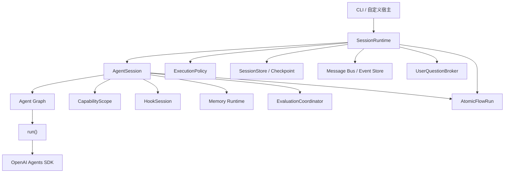
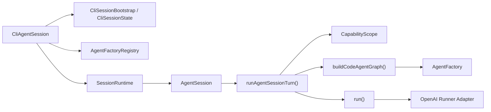
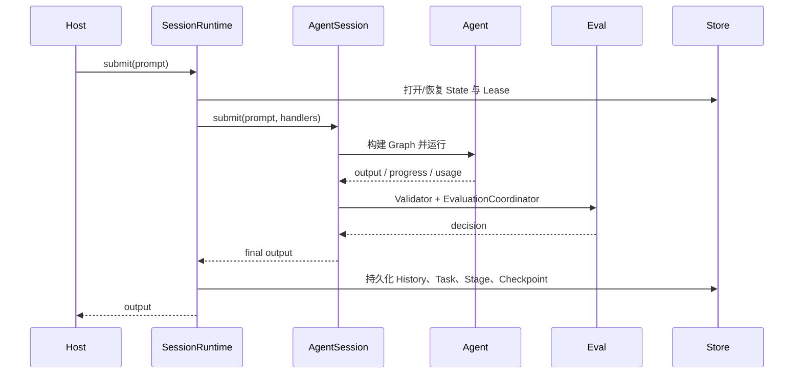

# Runtime 与编排

`@yiku/agent-orchestrator` 是 Yiku 的执行组合根。它把配置、Agent、工具、Session、Task、Hook、
Memory、Eval 和 Atomic Flow 连接成一个可取消、可恢复、可观测的运行。

## 分层



### `run()`

最底层 Runner Adapter。它执行一个已构建的 OpenAI Agent，处理模型调用、Tool、Handoff、取消、
用量和通用 Runtime Atom。它不解析项目配置，也不拥有持久 Session。

### `AgentSession`

单个逻辑会话的执行入口。它解析 Agent Graph，装配本次 Submit 的 Capability、权限、Hook、
Memory 和 Eval，并支持多次 `submit()`。

### `SessionRuntime`

长程任务组合根。它维护 Stage、预算、Session State、Checkpoint、Task、消息、Trace、用户问题、
压缩和恢复。CLI 持有一个 Runtime，退出时统一关闭其资源。

## 代码级执行链

当前一次持久 CLI Session 的装配跨越以下入口：



- `CliSessionBootstrap` 读取用户和项目配置、发现 Skills，并打开持久 Session State；
- `CliAgentSession` 创建 Hook、Permission Profile、MCP、Memory、Eval、Agent 管理和
  Checkpoint 资源；
- `SessionRuntime` 负责 Stage、恢复、消息和用户问题；
- `AgentSession` 负责 Hook、Prompt Expansion、History 和 Transcript；
- `runAgentSessionTurn()` 负责单个 Turn 的 Memory、Capability、Agent Graph、Runner 和 Eval；
- `run()` 只执行已构建 Agent，并把 Provider 事件写入 Atomic Flow。

这条链解释了公共 API 中同时存在 `run()`、`runAgentSessionTurn()`、`AgentSession` 和
`SessionRuntime` 四种粒度。它们不是同义封装：越靠下层，调用方需要自行承担的资源和策略越多。

## 配置解析

用户配置 `~/.yiku/config.yaml` 与项目配置 `./config.yaml` 深度合并，项目值优先。Orchestrator
在启动前解析并校验：

- `models`：模型名、API Key 环境变量、Base URL 和 Context Window；
- `agents`：默认 Agent、类型、模型、Skills、Handoffs 和 Delegates；
- `skills`：指令和允许的 MCP Target；
- `mcp`：`stdio` 或 `streamable-http` Server；
- `runtime`：Stage、Turn、Tool、时间、压缩和并发预算；
- `memory`：启用、提取和失败模式；
- `flow`：Trace Receipt 是否进入事件流；
- `evals`：模式、Profile、并发、阈值、修复和 Verification Command。

未知字段、无效引用和 Managed Policy 禁止的能力在运行前失败。配置细节见
[配置与存储](../atoms/configuration-and-storage.md)。

## Session 生命周期



一个顶层 Prompt 对应一个 Atomic Flow Run。长任务可以包含多个 Stage，但保持同一个 Session
身份。Stage 在以下情况结束或暂停：

- 正常完成；
- 达到 Turn、Tool、时长或无进展预算；
- 等待用户输入或审批；
- 用户取消；
- Provider、工具、Hook、Validator 或 Eval 失败。

`autoContinue` 允许 Runtime 在可继续的停止原因后开启下一 Stage。跨进程恢复只从已持久化的稳定
Stage 边界开始，不序列化 SDK 内部 `RunState`。等待中的 User Question 作为 Pending Input
持久化；恢复时根据 Provider Continuation Capability 使用明确标记的 reconstructed continuation，
或保持 `needs-review`。

## Agent Graph

Agent Graph 由配置中的 Agent 定义构成。每个节点指定：

- `type`：内置 `code`、`research` 或注册的自定义 Factory；
- `model`：模型配置键；
- `skills`：该 Agent 可见的能力；
- `handoffs`：SDK 原生控制权转移目标；
- `delegates`：由工具调用的子任务目标。

`AgentFactoryRegistry` 根据类型构建 Agent。`CodeAgentFactory` 和 `ResearchAgentFactory` 是内置
实现。Factory 可以返回领域 `AgentRunObserver` 和 `AgentOutputValidator`；不提供 Observer 时
仍获得通用 Runtime Flow。

Graph 按每个节点自己的 `type` 选择 Factory。调用方传入的 `agentType`、`modelKey` 和临时激活
Skill 只覆盖根节点，不传播到 Handoff；Handoff 继续使用自己的 Type、Model 和 Skill 配置。
Code Agent 未声明 `skills` 时默认获得 `agents + code + skills + tasks`，其他 Agent 默认只获得
通用 Skill Catalog，领域工具由各自 Factory 创建。

`AgentFactoryInput.tools` 是 Orchestrator 已按 Capability Scope 收敛后的宿主工具契约。Factory
必须保留这些工具，并与自己的领域工具组合；Research Factory 因此组合：

```text
web_search + recordEvidenceTool + recordResearchClaimTool
+ skillListTool + skillInspectTool + skillRunTool
+ Agent 显式声明的 MCP / Delegate / 其他受限工具
```

组合后的 Tool Name 必须唯一。Research 默认不会获得 Code Workspace 工具；只有宿主在 Agent
配置中显式声明并通过 Permission、Workspace Access 和 Managed Policy 后，额外工具才进入 Scope。

## Handoff、Delegate 与 Session Subagent

三种协作机制语义不同：

| 机制 | 生命周期 | 控制权 | 典型用途 |
| --- | --- | --- | --- |
| Handoff | 当前 SDK Run | 转移给目标 Agent | 专业路由 |
| Delegate | 当前任务内 Tool Call | 父 Agent 等待结果后继续 | 有界并行子任务 |
| Session Subagent | Session 持久 Profile/Instance | 由管理服务显式启动 | 可复用专家角色 |

Delegate 支持只读、共享读写和 Worktree 隔离。共享写入通过 `WorkspaceWriteLock` 串行化；
Worktree 由 `WorktreeManager` 创建、计算变更并清理。外部副作用不在本地事务内，恢复时可能要求
`completed`、`retry` 或 `abandon` 复核。

完整使用方式见 [Subagents](../features/subagents.md)。

## Capability Scope

`CapabilityScope` 按 Agent 配置装配能力：

- Code Toolset；
- Task 和 TODO Adapter；
- Delegate；
- Agent 管理；
- Skill Runtime；
- MCP Tool；
- User Question；
- Permission Handler。

能力取 Agent 声明、Skill Snapshot、MCP allowlist、Workspace Access 和 Managed Policy 的交集。
项目内容不能通过配置自行提升宿主权限。

### 通用 Skill 装配

持久 CLI Session 的 `SKILL.md` 链路如下：

```text
builtin / ~/.yiku / <workspace>/.yiku
  -> discoverSkills()
  -> SkillRuntime Catalog
  -> createSkillRuntimeSkill(agentType)
  -> CapabilityScope 的 "skills"
  -> AgentFactoryInput.tools
  -> CodeAgentFactory / ResearchAgentFactory
```

Catalog 只常驻名称、描述和兼容 Agent Type。`skillInspectTool` 按需返回正文与 Skill Root；
`skillRunTool` 先按当前 Agent Type 和 MCP Policy 生成 Snapshot，再在独立只读
`runAgentSessionTurn()` 中执行。Slash Command 激活发现式 Skill 时也先执行同一 Agent Type 与
Capability 校验。

## Prompt 信任边界

Runtime 使用 `PromptSegment` 保留上下文来源、类型、信任级别、可选 Source ID 和 Digest。只有
宿主显式提供的 Runtime/User Instructions 可以进入 Agent System Instructions。以下内容统一作为
带边界的 `untrusted` User-level Reference 输入：

- Conversation History 和模型生成的压缩摘要；
- Workspace Instructions、项目 `config.yaml` / `.env` Instructions；
- Project Skill、Project/Session Agent Profile；
- Hook Additional Context 和 Memory Recall；
- Tool、MCP、Hosted Web Search、Shell 和 Apply Patch 输出。

Reference 内容经过 XML 转义，并附带不可覆盖 Runtime Instructions、不可提升权限和不可扩展 Tool
Scope 的声明。OpenAI Runner 在每次模型调用前重新包装 Tool Result，因此 CLI/Trace 可以保留原始
展示，而模型只读取受边界保护的副本。

`PromptGuard` 拒绝空输入、异常控制字符和超出预算的 Prompt/Segment，并对常见指令覆盖、Prompt
窃取、角色替换和 Tool 强迫特征发出不包含原文的 `prompt_risk_detected`。该检测只提供风险信号；
是否阻断仍由 Managed Hook 或宿主 Policy 决定，Tool Permission 和 Workspace Boundary 始终独立
执行。

## Hook、Memory 与 Eval 顺序

关键顺序如下：

1. Session/Prompt Hook 在对应生命周期边界运行；
2. Memory Recall 在 Agent 上下文构建前完成；
3. Tool Hook 在副作用前后包围 Tool 调用；
4. 领域 Validator 在 Agent 输出产生后运行；
5. 工业 Evals 读取最终输出、Artifact、Receipt、Research Manifest 和 Atomic Snapshot；
6. Completion Policy 决定 `accepted`、`degraded`、`retry`、`needs-review` 或 `rejected`；
7. 只有 `accepted` 输出自动进入 Memory Extraction/Promotion；未启用工业 Evals 时，成功且通过
   Validator 的输出先提取 Memory，再运行兼容 Eval。

CLI 默认使用 `enforce`。一次自动修复保持同一 Task、创建新 Attempt，并受 Profile
`maxRepairAttempts` 限制。

Context Compact 独立于 Memory：前者替换发送给模型的 Conversation History，后者管理 Working
与长期知识。自动 Compact 只发生在可继续的 Stage 边界，并在成功后同步 Session State。详见
[Context Compact](../features/context-compaction.md)。

## 用户交互

`UserQuestionBroker` 把 Tool 发起的问题转换为宿主请求。等待问题时 Stage Deadline 暂停；回答后
同一 Submit 继续。非交互模式只接受可信 Manifest、显式答案文件或 Managed Policy 覆盖的输入；
缺少授权时 fail-closed，不自动选择首个选项。

权限审批、Hook Trust、MCP Elicitation 和恢复复核均由宿主提供处理器，Orchestrator 不直接渲染
UI。

## 宿主事件与交互契约

Runtime 当前同时维护两套事件表示：

- `AgentProgressEvent`：CLI 与兼容调用方使用的联合类型；
- `AgentMessageEnvelope`：带 `eventId`、时间和 Agent/Session/Task 关联信息的消息协议。

`progressEventToEnvelope()` 和 `envelopeToProgressEvent()` 在两者之间投影。持久 Session 可以把
Envelope 写入 `AgentEventStore`，CLI 仍主要消费 Progress Event。
Memory 的 `memory_operation` 和 Sandbox 的 `runtime_boundary_changed` 使用同一出口，因此
Session JSONL、Trace、宿主回调与 Atomic Flow 可以按 Session/Run 关联核对。Memory Event
不携带 Prompt、回复或记忆正文；Sandbox 边界变化在 Atomic Flow 中投影为
`runtime.boundary`。

Permission、Workspace 写授权和 User Question 的请求/响应类型目前来自
`@yiku/agent-code`。宿主通过 Handler 回调接入；等待用户问题时 `SessionRuntime` 使用
`UserQuestionBroker` 管理暂停、回答和取消，并把 Pending Question 写入 Session State v5。
该接口适合 Node 进程内调用，但当前没有对应的 HTTP/SSE Command 协议。

子 Agent 的消息使用 `AgentMessageEnvelope`，通过 `agentId`、`agentSessionId`、`parentAgentId`、
`parentToolCallId` 和 `taskId` 建立父子关联；同一 `agentId` 的消息按发布顺序串行。完整协议见
[Agent-to-Agent 与 Subagents](../features/subagents.md)，权限决策链见
[Permission 与执行边界](../features/permissions.md)。

## 状态与恢复

Session State 保存：

- History 与 Context 摘要；
- Stage、预算和 Continuation 摘要；
- Task、Subagent Profile 和 Instance；
- 已完成与进行中的操作摘要；
- Pending Question、Continuation Strategy 和 Side-effect Review；
- Checkpoint 和 Workspace Snapshot 引用；
- Eval 与工作记忆相关状态。

写入使用 Session Store 和 Lease 防止并发进程同时拥有同一 Session。Workspace Checkpoint
恢复会覆盖目标快照范围内的文件，因此 CLI 在执行 `/rewind` 前要求显式确认。

## 公共入口

| 入口 | 用途 |
| --- | --- |
| `run()` | 运行已构建 Agent |
| `runAgentSession()` | 单轮兼容入口，自动创建和关闭 `AgentSession` |
| `AgentSession` | 多轮会话、领域能力和 Eval |
| `SessionRuntime` | 持久 Session、Stage、恢复和宿主集成 |
| `resolveRuntimeConfig()` | 合并并校验 Runtime 配置 |
| `AgentFactoryRegistry` | 注册 Agent 类型 |
| `CapabilityScope` | 装配受限能力 |
| `EvaluationCoordinator` | 执行 Eval 与修复流程 |

最小宿主示例：

```ts
import { runAgentSession } from "@yiku/agent-orchestrator";

const output = await runAgentSession("审查当前项目的错误处理", {
  agentKey: "code",
  cwd: process.cwd(),
});

console.log(output);
```

需要长期复用时应持有 `SessionRuntime` 或 `AgentSession`，并在退出时调用 `close()`。

## 错误与资源所有权

- 配置错误在创建 Session 前抛出。
- 取消信号传播到 Runner、工具、Hook、Eval、Store 和修复流程。
- 输出 Validator 失败阻止标准 Session 完成。
- Eval `needs-review` 和 `rejected` 由 `EvaluationGateError` 表达。
- 调用方创建的 Memory Manager、Atomic Flow 或外部连接由调用方关闭。
- Runtime 自己创建的 Toolset、MCP、Trace、Store 和消息资源按逆序关闭。
- CLI 当前仍在 Orchestrator 之外重复注册默认 Factory；自定义宿主应使用 Orchestrator 默认
  Registry，而不是复制 CLI 组合逻辑。

## 相关文档

- [包边界](package-boundaries.md)
- [CLI](../features/cli.md)
- [Agent-to-Agent 与 Subagents](../features/subagents.md)
- [Context Compact](../features/context-compaction.md)
- [Permission 与执行边界](../features/permissions.md)
- [Hooks](../features/hooks.md)
- [Memories](../features/memories.md)
- [Evals](../features/evaluations.md)
- [Atomic Flow](../atoms/atomic-flow.md)
- [Trajectory](../atoms/trajectory.md)
