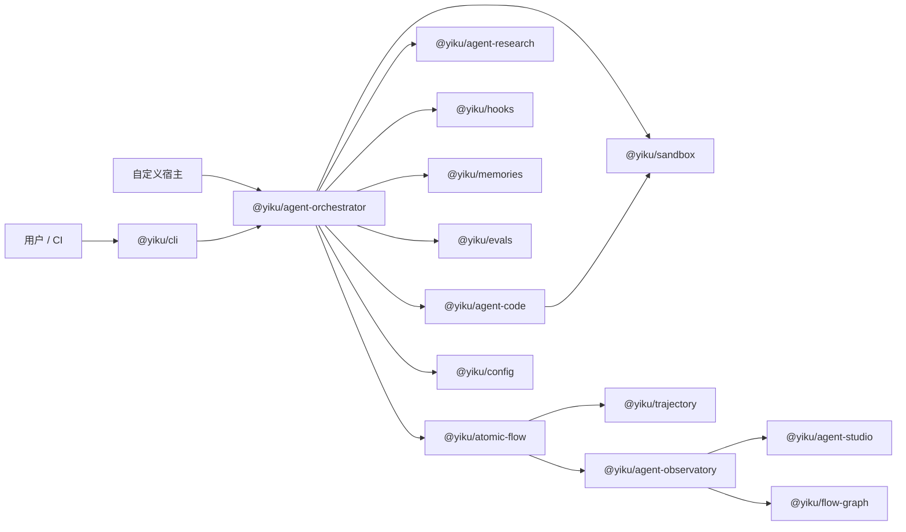

# 系统总览

Yiku 是一个面向软件工程与证据研究任务的本地 Agent 运行平台。它以 Ink CLI 作为默认宿主，
由 Orchestrator 统一组合模型、Agent、工具、Skills、Hooks、MCP、Memory、Evals 和观测能力。

## 核心目标

- 为交互式和非交互式任务提供同一套 Agent Runtime。
- 把 Agent 定义、执行编排、基础协议和展示宿主分开维护。
- 在 Workspace 边界内执行代码工具，并对风险命令和外部副作用进行授权。
- 通过持久 Session、Checkpoint、Task 和 Memory 支持长程任务。
- 以 Atomic Flow 记录运行事实，并派生 Trajectory 和 Agent Studio 视图。
- 在任务完成前执行可解释的质量评估和完成策略。

## 系统关系



## 宿主模型

Yiku 当前的 Agent 执行宿主是 Node 进程：

- CLI 在进程内持有 `SessionRuntime`，把 Ink 交互实现为 Permission、User Question、Hook Trust
  和 MCP Elicitation Handler；
- 自定义 Node 宿主可以直接使用 `runAgentSession()`、`AgentSession` 或 `SessionRuntime`；
- Research Playground 使用 `AgentFactory` 和 `run()` 自行装配单次 Research Run；
- Agent Observatory Web 只消费 Atomic Flow，不创建或控制 Agent Session。

因此 CLI 和低层自定义宿主共享 Orchestrator，但仓库当前还没有让浏览器客户端与 CLI 共同依赖的
Session Command/Event 协议。Web 运行 Agent 时应由服务端持有 Runtime，浏览器只通过受控传输
访问，不能把 Workspace Tool、密钥或授权决策直接下放到浏览器。

## 一次任务的主链

1. CLI 解析参数，在交互模式下确认 Workspace 授权；非交互模式要求已有授权。
2. `@yiku/config` 合并用户配置和项目配置，Orchestrator 校验模型、Agent、Skill、MCP、
   Runtime、Memory、Flow 和 Eval 配置。
3. `SessionRuntime` 打开或恢复 Session，装配持久状态、Task、Checkpoint、Memory、MCP 和消息
   总线。
4. `AgentSession` 根据 Agent Graph 构建 Code、Research 或自定义 Agent，并注入本次 Submit
   的权限和用户提问处理器。
5. Runtime 调用 OpenAI Agents SDK，工具、Handoff、Delegate、Hook 和用户交互都在统一生命周期
   内执行。
6. Atomic Flow 为输入、模型、工具、Agent、Skill、Memory、Hook 和 Eval 分配 Run 内有序事件。
7. 成功输出经过领域 Validator 和 Evals；Completion Policy 决定接受、降级、重试、待复核或
   拒绝。
8. Session 持久化阶段状态和消息，Atomic Flow 可投递到本地 Agent Observatory，Trajectory
   从同一事件流派生。

## 能力地图

| 能力 | 主要入口 | 所有者 |
| --- | --- | --- |
| 终端交互与自动化 | `yiku`、`yiku web` | `@yiku/cli` |
| Session 与 Agent 执行 | `SessionRuntime`、`AgentSession`、`run()` | `@yiku/agent-orchestrator` |
| 代码理解和修改 | `CodeAgent`、`CodeToolset` | `@yiku/agent-code` |
| 权限与执行边界 | `PermissionRequest`、`PermissionProfileStore`、`ShellPolicy` | Agent Code、CLI、Orchestrator |
| Shell 进程隔离 | `PlatformShellSandbox` | `@yiku/sandbox` |
| 证据研究和报告验证 | `ResearchAgent`、`EvidenceLedger` | `@yiku/agent-research` |
| 生命周期策略 | `HookEngine`、`HookSession` | `@yiku/hooks` |
| 长期记忆 | `MemoryManager`、`MemoryRuntime` | `@yiku/memories` |
| 上下文压缩 | `ContextBudget`、`ContextCompactor` | `@yiku/agent-orchestrator` |
| 质量评估 | `EvalPlanner`、`EvalScheduler`、`CompletionPolicy` | `@yiku/evals`、Orchestrator |
| 运行事实协议 | `AtomicFlowRun` | `@yiku/atomic-flow` |
| 执行轨迹 | `projectTrajectory()` | `@yiku/trajectory` |
| 通用 Studio 宿主 | `StudioServer`、`StudioShell` | `@yiku/agent-studio` |
| Yiku 观测 UI | `yiku web`、Observatory 插件 | `@yiku/agent-observatory` |
| 图连线 | `OrthogonalRouter` | `@yiku/flow-graph` |

## 状态与存储

全局配置、密钥和权限位于 `~/.yiku`。项目 Session、日志、Evals 和 Memory 位于：

```text
~/.yiku/workspaces/<parent>_<workspace>[_<8-char-hash>]/
```

Workspace 名称冲突时才追加 8 位路径摘要。运行数据不写入项目内的 `.yiku`；旧的
`yiku_` 前缀目录不会被自动扫描或迁移。完整路径契约见
[配置与存储](../atoms/configuration-and-storage.md)。

## 当前边界

- Yiku 依赖 OpenAI Agents SDK；Research Web Search 要求模型与 Provider 支持 Responses API。
- `@yiku/sandbox` 在 macOS 使用 Sandbox Profile，在 Linux 使用 rootless `bubblewrap`；
  平台隔离自身失败时不自动扩大边界。Code Terminal 的 Host Policy 降级会同步收紧权限策略并
  发出边界变化事件，Verification Command 则要求强隔离。
- 外部服务副作用无法获得 exactly-once 保证，恢复时可能进入人工复核。
- Agent Studio 默认只绑定回环地址，是本地开发与观测工具，不是远程授权边界。
- Atomic Flow 是运行观测的唯一事实源；Trajectory 和 Studio 状态都是可重建投影。

## 阅读路径

- 了解模块职责：[包边界](package-boundaries.md)
- 了解执行生命周期：[Runtime 与编排](runtime-and-orchestration.md)
- 了解观测链路：[可观测性](observability.md)
- 使用终端：[CLI](../features/cli.md)
- 理解安全边界：[Permission 与执行边界](../features/permissions.md)、
  [Sandbox](../atoms/sandbox.md)
- 理解上下文与知识：[Context Compact](../features/context-compaction.md)、
  [Memories](../features/memories.md)
- 理解多 Agent 协作：[Agent-to-Agent 与 Subagents](../features/subagents.md)
- 理解完成门禁：[Evals](../features/evaluations.md)
- 开发 Agent：[Code Agent](../features/code-agent.md)、
  [Research Agent](../features/research-agent.md)
- 理解底层协议：[Atomic Flow](../atoms/atomic-flow.md)、
  [Trajectory](../atoms/trajectory.md)、[Atom 目录](../atoms/atom-catalog.md)
