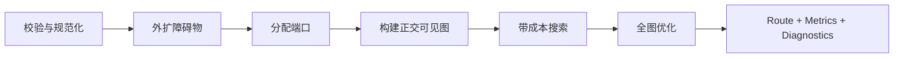

# Flow Graph

`@yiku/flow-graph` 是无 UI 依赖的正交布线包。调用方提供矩形节点、语义边、端口约束和额外障碍
物，路由器返回稳定折点、圆角 SVG Path、质量指标和降级诊断。

## 输入

```ts
interface FlowGraphInput {
  nodes: readonly GraphNode[];
  edges: readonly GraphEdge[];
  obstacles?: readonly GraphObstacle[];
}
```

基本使用：

```ts
import { OrthogonalRouter } from "@yiku/flow-graph";

const router = new OrthogonalRouter();
const result = router.route({
  nodes: [
    { bounds: { x: 0, y: 20, width: 100, height: 44 }, id: "input" },
    { bounds: { x: 240, y: 20, width: 100, height: 44 }, id: "tool" },
  ],
  edges: [
    {
      id: "input-to-tool",
      source: { nodeId: "input" },
      target: { nodeId: "tool" },
    },
  ],
  obstacles: [
    {
      bounds: { x: 130, y: 0, width: 70, height: 50 },
      id: "reserved-panel",
    },
  ],
});
```

Node ID、Edge ID 和 Obstacle ID 必须唯一。Edge Endpoint 必须引用存在的 Node。矩形尺寸、
坐标、Slot 和 Route Bounds 必须是有限有效数值。

## 端口

```ts
{
  source: {
    nodeId: "input",
    port: { mode: "fixed", side: "right", slot: 0.5 },
  },
  target: {
    nodeId: "tool",
    port: { mode: "preferred", side: "left" },
  },
}
```

模式：

- `fixed`：Side 和显式 Slot 是硬约束；
- `preferred`：优先使用指定 Side/Slot，无解时可以调整；
- 未配置：根据节点相对位置和全图质量自动选择。

Slot 范围为 `0..1`。多条边在同一节点上稳定分配不同 Slot；显式固定复用时保留配置并生成诊断。

`portStubLength` 控制端口离开节点后的最短直线段，独立于障碍物 `clearance`。

## 路由流程



关键行为：

1. 对输入排序和规范化，避免数组顺序影响结果；
2. 按 Clearance 外扩 Node 和额外 Obstacle；
3. 为固定、偏好和自动端口生成候选；
4. 使用正交可见图搜索折线路径；
5. 评估碰撞、重叠、过近平行、交叉、长度、折点和端口偏离；
6. 通过有限优化轮次减少全图冲突；
7. 无零冲突解时返回可见 Fallback 和诊断。

交叉是有限成本而不是绝对禁止。为了避免极端绕行，路由器可以保留少量方向清晰的交叉。

## 输出

```ts
interface RoutedGraphEdge {
  id: string;
  points: readonly GraphPoint[];
  path: string;
  sourcePort: ResolvedPort;
  targetPort: ResolvedPort;
  metrics: RouteMetrics;
  diagnostics: readonly RouteDiagnostic[];
  fallback: boolean;
  length: number;
}
```

全图 `FlowGraphMetrics` 聚合：

- 路径数量；
- 碰撞；
- 重叠；
- 过近平行；
- 交叉；
- 长度；
- 折点；
- 端口偏离；
- Fallback 数量；
- 优化轮次。

调用方应展示 Fallback 或 Warning，而不是把合法但不完美的路径当作结构错误。

## 诊断

| Code | 含义 |
| --- | --- |
| `ROUTE_COLLISION_FALLBACK` | Fallback 仍有碰撞 |
| `ROUTE_CROSSING_REMAINS` | 优化后仍有交叉 |
| `ROUTE_OPTIMIZATION_LIMIT` | 达到优化轮次上限 |
| `ROUTE_OVERLAP_REMAINS` | 仍有共享线段 |
| `ROUTE_PORT_REUSED_BY_CONSTRAINT` | 固定约束要求端口复用 |
| `ROUTE_PROXIMITY_REMAINS` | 平行线间距仍不足 |

Diagnostic 只描述路由质量。结构非法输入抛出 `FlowGraphError`。

## Route Bounds

Edge 可提供 `routeBounds` 限制搜索区域。Bounds 必须包含 Source/Target 和固定端口出口。它适合
把边限制在特定画布区域，但过小 Bounds 会增加 Fallback。

## 线段偏移

`offsetOrthogonalRoute()` 在路由后按基础段号平移指定线段：

```ts
import { offsetOrthogonalRoute } from "@yiku/flow-graph";

const points = offsetOrthogonalRoute(route.points, {
  2: 12,
  4: -8,
});
```

段号从 `1` 开始。水平段正数向下，垂直段正数向右。函数保持起点和终点，必要时增加短正交连接
段。

偏移是显式展示后处理：

- 不重新避障；
- 不更新 Router Metrics；
- 调用方负责检查偏移后结果；
- 不应用于修复结构非法路径。

## SVG 与其他渲染

Router 直接返回圆角 SVG `path`，也可以从 `points` 自行渲染：

- SVG Polyline/Path；
- Canvas 2D；
- DOM Overlay；
- React；
- 静态测试快照。

核心包不访问 DOM，也不决定 Stroke、Marker、Hover、动画或命中区域。

## 确定性

相同规范化输入和 Router Options 产生相同结果。确定性依赖：

- 按 ID 排序节点和边；
- 稳定端口候选顺序；
- 稳定搜索 Tie-breaker；
- 有界优化轮次；
- 不使用随机数或测量时序。

这允许路径 Snapshot、缓存和回归比较。

## 边界情况

- 空图返回空 Route 和零 Metrics。
- Source 与 Target 相同生成节点外自环。
- 相邻面对面端口可以直接连接。
- Node 与额外 Obstacle 重叠时可能进入 Fallback。
- 固定端口不可达时不擅自改变 Side。
- 合法输入无完美解时返回 Fallback，不抛结构错误。
- 超过配置的 Node、Edge 或坐标上限时拒绝，避免资源失控。

## Options

`OrthogonalRouterOptions` 可以设置：

- `clearance`
- `portStubLength`
- `parallelGap`
- `roundingRadius`
- Bend/Crossing/Overlap/Proximity/Port Deviation Penalty
- 最大 Node、Edge、坐标和优化轮次

自定义值必须是有限、非负并满足对应上限。

## 公共入口

- `OrthogonalRouter`
- `offsetOrthogonalRoute`
- `toRoundedSvgPath`
- 几何 Helper
- Graph、Port、Route、Metrics 和 Diagnostic 类型
- `FlowGraphError`

## 验证

```bash
corepack pnpm --filter @yiku/flow-graph build
corepack pnpm --filter @yiku/flow-graph test
```

Observatory 接入关系见 [可观测性](../architecture/observability.md)。
