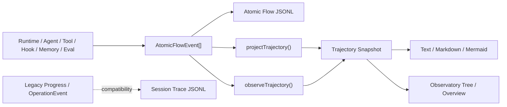

# Trajectory

`@yiku/trajectory` 把 Atomic Flow 投影为层级执行轨迹，并提供文本、Markdown、Mermaid 和兼容
JSONL Trace。标准 Agent Run 以 Atomic Flow 为唯一事实源。

## 定位与数据来源



标准路径不单独记录一份 Trajectory 状态。Atomic Flow JSONL 保存事实，Trajectory 在读取或订阅时
重建；因此 Topology、Replay 和 Trajectory 可以共享同一个 `runId` 与 `sequence` 前缀。

## 数据模型

```ts
interface Trajectory {
  id: string;
  startedAt: string;
  endedAt?: string;
  steps: readonly TrajectoryStep[];
}

interface TrajectoryStep {
  atomKey?: string;
  id: string;
  kind: AtomicKind | OperationKind;
  name: string;
  parentId?: string;
  iteration?: number;
  startedAt: string;
  endedAt?: string;
  status: "running" | "completed" | "failed";
}
```

Step ID 对应 Atomic Instance ID。Parent、Iteration、状态和时间直接来自事件前缀。

示例投影：

```json
{
  "id": "run-42",
  "startedAt": "2026-08-20T10:00:00.000Z",
  "endedAt": "2026-08-20T10:00:03.000Z",
  "steps": [
    {
      "atomKey": "run",
      "id": "run-instance",
      "kind": "input",
      "name": "Run",
      "startedAt": "2026-08-20T10:00:00.000Z",
      "endedAt": "2026-08-20T10:00:03.000Z",
      "status": "completed"
    },
    {
      "atomKey": "tool.call",
      "id": "tool-17",
      "parentId": "run-instance",
      "iteration": 2,
      "kind": "tool",
      "name": "Tool Call",
      "startedAt": "2026-08-20T10:00:01.000Z",
      "endedAt": "2026-08-20T10:00:02.000Z",
      "status": "completed",
      "output": { "summary": "Read 120 lines" }
    }
  ]
}
```

## 静态投影

```ts
import {
  projectTrajectory,
  renderTrajectoryText,
} from "@yiku/trajectory";

const trajectory = projectTrajectory(events);
console.log(renderTrajectoryText(trajectory));
```

投影规则：

- 按 Sequence 排序；
- 所有 Event 必须属于同一个 Run；
- `throughSequence` 可以投影任意 Replay 前缀；
- 内部 Trace/Trajectory Receipt 不进入用户轨迹；
- 空 Event 数组必须显式提供 `runId`；
- 相同事件前缀产生相同轨迹。

混合 Run 直接失败，不通过筛选静默丢失事件。

### 生成算法

`projectTrajectory()` 的生成步骤是确定的：

1. 复制并按 `sequence` 升序排列输入；
2. 从首事件取得 `runId`，空输入则要求调用方显式提供；
3. 拒绝包含其他 `runId` 的事件集合；
4. 应用 `throughSequence`，并过滤 `internal=true` 的 Trace/Trajectory 回执；
5. 以 `instance.id` 为键 Fold：首个事件创建 Step，后续事件原位更新同一 Step；
6. `start`、`scheduled`、`delta` 映射为 `running`，`end`/`skipped` 映射为
   `completed`，`error` 映射为 `failed`；
7. 终态写入 `endedAt`，错误摘要写入 `error`，最新有界 Payload 写入 `output`；
8. Atom Key 为 `run` 的终态时间成为 Trajectory 的 `endedAt`。

Step 顺序是各 Instance 首次出现在排序后事件流中的顺序。`delta` 不新增 Step，也不改变其顺序。
投影不根据 Edge 猜测层级，只使用 `instance.parentId`；Edge 保留在 Atomic Flow 中用于流程关系。

## 实时投影

```ts
import { observeTrajectory } from "@yiku/trajectory";

const projection = observeTrajectory(flow);
const unsubscribe = projection.subscribe((trajectory) => {
  console.log(trajectory.steps.length);
});

const snapshot = projection.snapshot();

unsubscribe();
projection.close();
```

`AtomicTrajectoryProjection` 订阅 Flow，但 Subscriber 错误不会影响来源运行。关闭 Projection 后
清理 Flow Subscription 和 Listener。

实时更新机制：

- 创建时先复制 `flow.snapshot().events`，避免漏掉订阅前事件；
- 后续事件按 Flow 分发顺序追加；
- 每次追加后从当前事件前缀重新生成不可共享状态的 Snapshot；
- Listener 逐个接收新 Snapshot，单个 Listener 抛错被隔离；
- `snapshot({ throughSequence })` 可在 Live Flow 上查看历史前缀；
- `close()` 幂等，关闭后不再接收事件或接受新 Listener。

这种实现优先保证与静态投影一致。Trajectory 不是命令通道，修改 Snapshot 不会反向修改 Agent、
Atomic Flow 或 Session State。

## Renderer

```ts
import {
  renderTrajectoryMarkdown,
  renderTrajectoryMermaid,
  renderTrajectoryText,
} from "@yiku/trajectory";
```

- Text：终端和日志；
- Markdown：Session 导出和审计；
- Mermaid：静态层级图；
- `includeRawValues`：显式允许时展示兼容 Operation 输入输出。

Atomic Payload 默认只包含摘要，因此 Renderer 不应依赖完整 Tool Input/Output。

## 浏览器入口

浏览器从以下入口导入投影能力：

```ts
import { projectTrajectory } from "@yiku/trajectory/browser";
```

该入口不包含 Node 文件系统 Trace，避免浏览器 Bundle 引入 `node:fs`。

## Trace

`Trace<TEvent>` 是兼容的追加式 JSONL 记录器：

```ts
import { Trace } from "@yiku/trajectory";

const trace = new Trace("/absolute/path/to/session.jsonl");
trace.record(event);
```

每行包含 Step、Recorded At、Event 和可选 Result。Trace 使用同步追加且不持有可关闭资源；
写入失败不应阻断 Agent Session，读取不存在或损坏的兼容 Trace 返回空列表。

Session Trace 与 Atomic Flow JSONL 用途不同：

| 数据 | 事实语义 |
| --- | --- |
| Atomic Flow JSONL | Run 级原子执行事实，可 Fold 和 Replay |
| Session Trace | 宿主 Progress Event 的兼容审计日志 |
| Trajectory | 从 Atomic Flow 派生的层级视图 |

## 存储结构

Yiku CLI 的相关数据默认位于同一个 Workspace Storage 下：

```text
~/.yiku/workspaces/<workspace>/
├── session/
│   ├── <session-id>.jsonl                 # 兼容 Progress Trace
│   └── <session-id>.events.jsonl          # AgentMessageEnvelope
└── logs/
    ├── atomic-runs/<run-id-sha256>/flow.jsonl  # 权威 Atomic Flow
    └── runs/<run-storage-key>/flow.jsonl       # Studio/Observatory 接收的 Flow 副本
```

Trajectory Snapshot 默认不单独落盘。需要长期保存或跨进程重建时，保存 Atomic Flow JSONL，再调用
`projectTrajectory()`。兼容 `Trace<TEvent>` 的每一行结构为：

```json
{
  "step": 17,
  "recordedAt": "2026-08-20T10:00:02.000Z",
  "event": { "type": "tool_output", "toolName": "readTool" },
  "result": "Read 120 lines"
}
```

`Trace` 在重新打开时读取最后一个合法 Step 并继续编号，写入使用同步 Append。它是 Best-effort
兼容审计：写入错误被吞掉，文件不存在或任一 JSON 行损坏时读取返回空数组。Atomic Flow Reader
则严格校验并报告 `ATOMIC_FLOW_JSONL_INVALID`；需要可靠 Replay 时必须使用 Atomic Flow。

## 兼容入口

`TrajectoryRecorder` 可以直接消费旧 `OperationEvent`。`AtomicTrajectorySink` 可以为旧宿主生成
`trajectory.project` Receipt。

标准 Orchestrator 不挂载该 Sink；它直接在结果中从 Atomic Flow 生成 Trajectory，Agent
Observatory 也从同一 Event 前缀投影。

## 层级与错误

- 投影保留生产者提供的 `parentId`，不伪造或改写因果关系；
- Observatory 仅在 Parent 存在且链路无环时建立树，缺失 Parent、自引用或环会展平为根级行；
- Renderer 消费扁平 Step 数组；Mermaid 按现有 `parentId` 输出连线，调用方应先校验外部输入；
- `error` 终态保留安全错误摘要；
- Delta 更新当前 Step，不创建新 Step；
- `scheduled` / `skipped` 主要用于 Flow Replay，不生成虚构的执行耗时。

## 应用场景

| 场景 | 推荐入口 | 原因 |
| --- | --- | --- |
| Run 完成后的诊断与导出 | `projectTrajectory(events)` | 结果确定、易于测试 |
| 运行中 UI | `observeTrajectory(flow)` | 自动跟随当前事件前缀 |
| Replay 到指定时刻 | `throughSequence` | 与 Topology 使用相同序列边界 |
| 终端或日志摘要 | `renderTrajectoryText()` | 紧凑、无浏览器依赖 |
| 审计文档 | `renderTrajectoryMarkdown()` | 可读且可纳入导出 |
| 静态结构说明 | `renderTrajectoryMermaid()` | 展示 Parent/Child 关系 |
| 旧宿主 Progress 审计 | `Trace` | 兼容现有 JSONL，不作为事实源 |

排查问题时先定位失败 Step 的 `id`/`atomKey`，再回到相同 `runId` 的 Atomic Event 查看
Sequence、Edge 和有界 Payload。性能分析可由 `startedAt`/`endedAt` 计算耗时，但不应把墙上时间
用于跨 Agent 的因果排序。

## 主要导出

- `projectTrajectory`
- `observeTrajectory`
- `AtomicTrajectoryProjection`
- `renderTrajectoryText`
- `renderTrajectoryMarkdown`
- `renderTrajectoryMermaid`
- `Trace` / `readTraceEntries`
- `TrajectoryRecorder`
- `AtomicTrajectorySink`
- `TRAJECTORY_ATOMS`

## 验证

```bash
corepack pnpm --filter @yiku/trajectory build
corepack pnpm --filter @yiku/trajectory test
```

来源事件见 [Atomic Flow](atomic-flow.md)，内置节点见 [Atom 目录](atom-catalog.md)。
