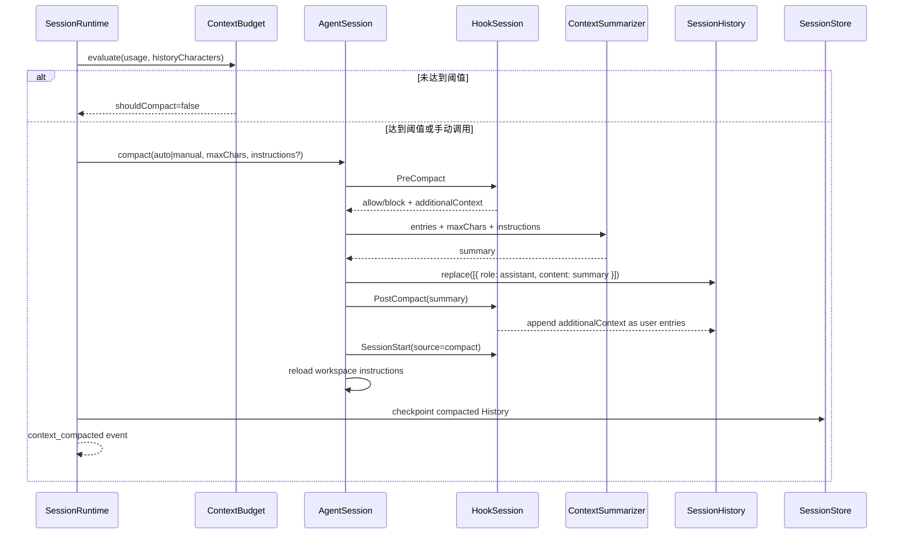

# Context Compact

Yiku 的 Context Compact 把过长的会话历史压缩为一条可继续执行的摘要。它解决模型上下文预算问题，
不删除 Session 的任务、Checkpoint、Working Memory、Agent Profile、Atomic Flow 或磁盘日志。

## 组件职责

| 组件 | 职责 | 不负责 |
| --- | --- | --- |
| `ContextBudget` | 判断是否自动压缩并计算摘要字符上限 | 调用模型或修改历史 |
| `ContextCompactor` | 运行 Hook、调用 Summarizer、校验摘要并替换 History | 决定 Stage 是否继续 |
| `OpenAIContextSummarizer` | 用无工具、单 Turn 的 Code Agent 生成纯文本摘要 | 保存 Session State |
| `AgentSession` | 暴露 `compact()`，压缩后重新装载 Session/Workspace 指令 | 自动触发时机 |
| `SessionRuntime` | 在可继续的 Stage 边界自动判断、同步 History 并发出事件 | 摘要内容生成 |
| CLI `/compact` | 发起手动压缩并展示进度 | 改变自动阈值 |

## 触发方式

### 自动触发

持久 `SessionRuntime` 只在一个 Stage 已结束且执行策略决定继续时调用 `maybeCompact()`。压缩不会在
模型或工具仍执行时插入，也不会打断当前 Stage。

判断优先级：

1. 同时存在 `contextWindow` 和本轮累计的 `peakInputTokens` 时，使用 Token 比例；
2. 缺少任一 Token 指标时，使用 History 字符数与 `32,768` 字符回退上限；
3. 达到 `compactAtContextRatio` 才压缩；摘要预算由 `compactToContextRatio` 计算；
4. Token 路径按每 Token 4 字符换算为 `maxSummaryChars`；
5. 成功后清空累计的 `peakInputTokens`，下一 Stage 重新计量。

默认配置：

```yaml
runtime:
  compactAtContextRatio: 0.7
  compactToContextRatio: 0.25
```

计算规则：

```text
Token 路径：
shouldCompact = peakInputTokens / contextWindow >= compactAtContextRatio
maxSummaryChars = floor(contextWindow * compactToContextRatio * 4)

字符回退：
shouldCompact = historyCharacters >= 32768 * compactAtContextRatio
maxSummaryChars = floor(32768 * compactToContextRatio)
```

`compactToContextRatio` 必须小于 `compactAtContextRatio`，两者都必须严格位于 `0` 和 `1` 之间。

### 手动触发

```text
/compact
/compact preserve decisions, open tasks, file paths, commands, and errors
```

参数作为 `customInstructions` 传给 Summarizer。未显式传入摘要上限时，优先使用 Hook 配置的
`compactionMaxChars`，否则默认 `8,000` 字符。手动压缩不依赖阈值。

## 完整流程



自动路径会立即把压缩后的 History 写入 Session State。手动 `/compact` 先修改当前
`AgentSession` 的内存 History；它会在后续正常 Session Checkpoint 时持久化，因此不要把
`/compact` 当作独立的持久化命令。原始 Transcript、Progress/Event JSONL 和 Atomic Flow 不被重写。

## 摘要契约

Input：

```json
{
  "entries": [
    { "role": "user", "content": "Implement the feature" },
    { "role": "assistant", "content": "Inspected runtime.ts" }
  ],
  "maxChars": 8000,
  "customInstructions": "Preserve decisions and unresolved tasks"
}
```

Output：

```json
"Goal: implement the feature. Completed: inspected runtime.ts. Remaining: ..."
```

`ContextSummarizer.summarize()` 返回字符串。摘要必须为非空纯文本，去除首尾空白后不得超过
`maxChars`。默认 OpenAI Summarizer 的固定要求是保留决策、约束、已完成工作、未完成任务、
文件路径、命令和错误，不得发明事实，并且不能调用工具。

## History 与信任边界

压缩成功后的 History 顺序为：

1. 一条 `assistant` 摘要；
2. `PostCompact` 返回的 Additional Context，以 `user` 条目追加；
3. `SessionStart(source=compact)` 与重新读取的 Workspace Instructions 进入独立的受来源标记
   Context Segment。

摘要属于模型生成内容，在后续 Prompt 中仍按 `untrusted` Conversation History 包装。压缩不会提升
权限、扩大 Capability Scope，也不会把 Hook 或 Workspace 内容变成 System Instructions。

## 事件与观测

成功的自动压缩发出：

```json
{
  "type": "context_compacted",
  "beforeEntries": 42,
  "afterEntries": 1
}
```

该 Progress Event 投影为 `context.compact` Atomic Atom。CLI 收到事件后重置当前 Context 使用量，
状态栏随后依据新的 `usage_updated` 事件重新累计。事件只记录条目数量，不暴露摘要正文。

## 原子性与失败语义

- `PreCompact` 的 `block` 或 `stop` 在调用 Summarizer 前终止，History 保持不变；
- Summarizer 抛错、返回空字符串或超出字符上限时，History 保持不变；
- AbortSignal 传递给 Summarizer；
- History 只在摘要完成并通过校验后一次性 `replace()`；
- `PostCompact` 在 History 替换后运行，其失败不会回滚已经生成的摘要；
- 未配置 Summarizer 时，手动和自动压缩都显式失败；
- 压缩只减少送入模型的 Conversation History，不删除审计记录或其他 Session 状态。

## 验证

```bash
corepack pnpm --filter @yiku/agent-orchestrator test
corepack pnpm --filter @yiku/cli test
```

配置字段见 [配置与存储](../atoms/configuration-and-storage.md)，Session 生命周期见
[Runtime 与编排](../architecture/runtime-and-orchestration.md)，Hook 契约见 [Hooks](hooks.md)。
