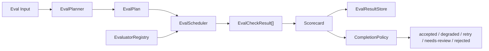
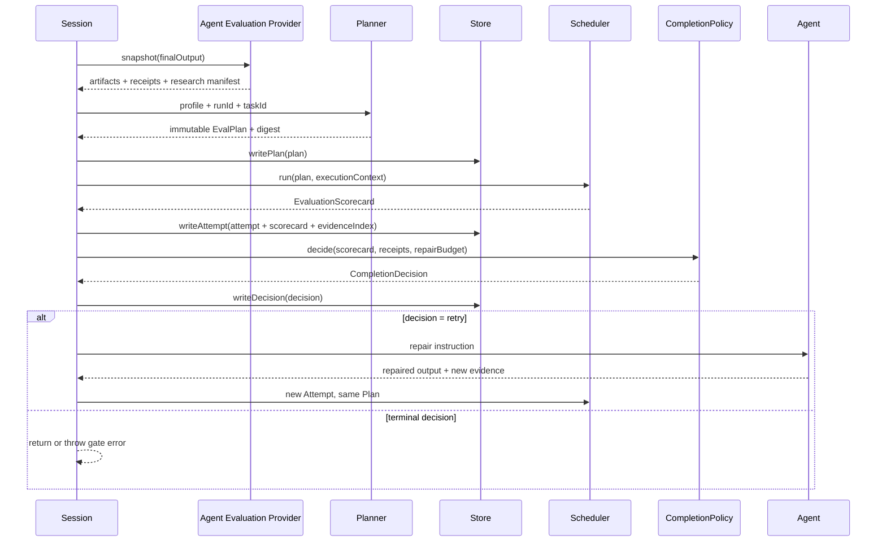

# Evals

`@yiku/evals` 为已完成的 Agent Run 提供可解释、可持久化的质量评估。它消费最终输出、Artifact、
Operation Receipt、Research Manifest 和 Atomic Flow Snapshot，不执行 Agent，也不独立决定
Session 终态。

## 两套入口

| 入口 | 用途 | 结果 | 当前使用位置 |
| --- | --- | --- | --- |
| `EvalRunner` | 兼容的顺序 Evaluator 列表 | `EvalScorecard` | 低层/旧宿主 |
| `EvalPlanner` + `EvalScheduler` | Profile、DAG、证据、不可变记录和并发限制 | `EvaluationScorecard` | CLI 持久 Session |
| `EvaluationCoordinator` | 组合 Plan、Attempt、Store、Completion Policy 和 Repair | `EvaluationOutcome` | Orchestrator |

新宿主需要质量门禁与审计时应使用工业链路。`EvalRunner` 仍受支持，但不提供 Plan、Attempt、
Evidence Index、Baseline 或自动修复语义。

## 评估链路





## 核心对象

### Profile

`EvalProfile` 定义：

- 模式：`observe` 或 `enforce`；
- Check 定义、权重和依赖；
- 质量阈值；
- 最大并发、输入大小、超时和修复次数；
- Required/Optional；
- Severity 和证据要求。

### Plan

`EvalPlanner` 把 Profile 与 Registry 能力解析为不可变 Plan。它校验：

- 重复 ID；
- 未知 Evaluator；
- 缺失依赖和依赖环；
- Check 数量和资源上限；
- Required Capability；
- 确定性 Digest。

Check 来源按以下顺序合并：Managed Profile、Project Profile、User Acceptance、Agent Factory、
Agent Suggestion。已有 ID 只能以完全相同的定义再次出现；低优先级来源不能重定义高优先级
Check。Managed Profile 同时决定 Mode、Threshold、Dimension Weight 和 Limits。Plan 创建后冻结，
一次 Repair 继续使用同一个 Plan Digest。

### Scheduler

`EvalScheduler` 按依赖 DAG 运行 Check：

- 单 Run 默认最多 4 个并发 Check；
- 全局默认最多 8 个并发 Run；
- 单 Run 最多 32 个 Check；
- AbortSignal 传播到排队、Evaluator、Verification Command 和 Repair；Store Commit 完成自身的
  原子写入，不接受同一取消信号；
- 单个 Evaluator 抛错转为结构化 `error` 结果；
- 依赖失败时下游为 `not-run`。

Scheduler 只启动所有依赖均为 `passed` 的 Ready Check，并按 Plan `ordinal` 保持稳定选择顺序。
同一 `concurrencyGroup` 默认串行，宿主可注入更高 Group Limit。Attempt Timeout 会把尚未运行的
Check 变为带 `EVAL_TIMEOUT` 的 `not-run`；外部 Abort 则终止整个评估，不伪造成 Scorecard。

## 执行协议

Evaluator Input 的核心结构：

```json
{
  "runId": "run-42",
  "taskId": "session-9",
  "attemptId": "attempt-1",
  "finalOutput": "Implemented and verified.",
  "finalOutputDigest": "sha256:...",
  "flowRef": "atomic:run-42",
  "taskSnapshotRef": "session:session-9",
  "artifacts": [],
  "operationReceipts": [],
  "runtimeMetrics": {
    "durationMs": 1234,
    "peakRssBytes": 67108864
  }
}
```

单个 Check Output：

```json
{
  "version": 1,
  "id": "flow-integrity",
  "evaluator": "flow-integrity-v2",
  "label": "Flow Integrity",
  "dimension": "safety-reliability",
  "severity": "blocker",
  "required": true,
  "status": "passed",
  "passed": true,
  "score": 1,
  "retryable": false,
  "evidenceRefs": ["atomic:run-42"],
  "summary": "Flow is valid.",
  "durationMs": 3
}
```

Evaluator 必须返回与 Planned Check 一致的 ID、Evaluator、Dimension、Severity 和 Required。
`status=error` 必须携带稳定 `errorCode`，`passed` 必须与 `status=passed` 一致；无效结果按协议错误
处理，不能进入成功 Scorecard。

## 评分

Scorecard 按 Dimension 和 Weight 聚合。默认维度包括 Correctness、Safety/Reliability、
Performance 和 Resource Efficiency。

规则：

- `error`、`not-run` 和缺失 Score 按 0 计入分母；
- Blocker、Secret、Boundary Violation 和 Artifact Drift 不能被平均分抵消；
- Required Check 失败影响完成决策；
- Digest 不包含运行时耗时等非确定性噪声；
- 相同 Plan、Input 和结果产生相同 Scorecard Digest。

每个 Dimension 先计算 Check Weight 加权分数；没有 Check 的 Dimension 记为 `1`。随后按 Profile
的 `dimensionWeights` 计算 `overallScore`。`averageScore` 是所有 Check 的简单平均，仅用于展示。
Grade 映射为：`S >= 0.95`、`A >= 0.90`、`B >= 0.80`、`C >= 0.70`，其余为 `D`。

`qualityPassed` 同时要求：无 Blocker 非通过、无 `partial`/`unknown` Operation Receipt、所有
Required Check 通过、总分达到 Threshold。`passed` 与 `qualityPassed` 保持一致。

## 默认 Evaluator

通用 Evaluator：

- `FlowIntegrityEvaluator`
- `FinalOutputEvaluator`
- `MemorySafetyEvaluator`
- `PerformanceBudgetEvaluator`
- `ResourceBudgetEvaluator`

可选 `JudgeProvider` 处理需要模型判断的内容。确定性检查优先，Judge 不能替代 Artifact、Evidence
或协议完整性。

## Code Eval

`@yiku/agent-code` 提供：

- 文件 Before/After Snapshot；
- Artifact Digest 和 Scope；
- Symlink 与边界证据；
- 结构化 Verification Command；
- 变更范围和 Artifact 一致性检查。

Verification Command 示例：

```yaml
evals:
  profiles:
    code-ci:
      type: code
      qualityThreshold: 0.85
      requireChanges: true
      commands:
        - id: lint
          command: corepack
          args: [pnpm, lint]
          network: deny
          writePolicy: isolated
          timeoutMs: 300000
```

`isolated` 命令在临时工作区运行；`read-only` 命令不能修改 Workspace。

## Research Eval

`@yiku/agent-research` 提供 Claim/Citation、冲突、来源多样性、时效、权威性和报告结构检查：

```yaml
evals:
  profiles:
    research-strict:
      type: research
      freshnessDays: 90
      minimumIndependentDomains: 3
      qualityThreshold: 0.85
```

缺失 Evidence、未知 Citation 或 Unsupported Claim 不能通过 Optional Judge 被抹除。

## Runtime 配置

```yaml
evals:
  enabled: true
  mode: enforce
  maxConcurrentRuns: 8
  maxRepairAttempts: 1
  timeoutMs: 600000
  profile: code-default
  profiles: {}
```

默认 Profile：

- `code-default`
- `research-default`

未显式选择时根据 Agent Type 选择。未知字段、无效 Profile 引用和越界上限在 Session 启动前
失败。

## Completion Policy

Orchestrator 的 `EvaluationCoordinator` 把 Scorecard 映射为：

| 决策 | 含义 |
| --- | --- |
| `accepted` | 达到质量和硬门禁 |
| `degraded` | 允许完成，但基础设施或可选能力降级 |
| `retry` | 可以在预算内修复后重评 |
| `needs-review` | 证据不足、未知副作用或基础设施状态需要人工判断 |
| `rejected` | 硬门禁或质量要求失败 |

CLI 默认 `enforce`。一次修复保持同一 Task，创建新 Attempt，并把失败 Check 与 Repair Instruction
反馈给 Agent。超过修复预算后不无限循环。

决策顺序：

1. `partial` 或 `unknown` Operation Receipt -> `needs-review`；
2. Blocker 失败 -> 有可修复项和预算时 `retry`，否则 `rejected`；
3. Required Check 为 `error`/`not-run` -> `needs-review`；
4. Required Check 失败或总分不足 -> `retry` 或 `rejected`；
5. 仅 Optional Check 未通过 -> `degraded`；
6. 其余 -> `accepted`。

`observe` 与 `enforce` 都生成完整记录。`observe` 不因非接受决策抛出 Gate Error，也不触发自动
Repair；`enforce` 对 `needs-review`/`rejected` 抛出 `EvaluationGateError`。`accepted` 和
`degraded` 都允许 Session 完成，但只有 `accepted` 自动晋升本轮长期 Memory。

## Store

`FileEvalResultStore` 持久化：

- Plan；
- Attempt；
- Scorecard；
- Evidence Index；
- Completion Decision；
- Baseline。

默认路径：

```text
~/.yiku/workspaces/<workspace>/evals/
```

一个顶层 Atomic Run 可能包含多个内部 Turn 或 Stage。第一次评估沿用 Atomic Run ID；后续评估
使用 `.eval-<序号>` 后缀派生独立 Eval Run ID，并通过 `flowRef` 继续关联同一 Atomic Flow。
因此每个 Eval Plan 仍保持不可变，多阶段续跑不会覆盖前一阶段的评估记录。

Store 使用私有权限、跨进程 Lock、临时文件、File Sync、原子 Rename 和目录 Sync。相同 Digest
重试幂等，不同 Digest 写入同一不可变 ID 返回冲突。

目录结构：

```text
~/.yiku/workspaces/<workspace>/evals/
├── runs/
│   └── <sha256-run-id>/
│       ├── plan.json
│       └── attempts/
│           └── <sha256-attempt-id>/
│               ├── attempt.json
│               ├── scorecard.json
│               ├── evidence-index.json
│               └── decision.json
├── baselines/
│   └── <sha256-suite-id>/<sha256-baseline-version>.json
├── feedback/
└── locks/
```

`writeAttempt()` 先在同目录临时目录内完整写入 Attempt、Scorecard 和 Evidence Index，Sync 后再
Rename，避免部分可见。Decision 只有在目标 Attempt 已存在且 Run/Task 关系一致时写入。Reader
重新校验 Version、Digest、Count 与对象关系；损坏数据返回 `EVAL_STORE_CORRUPT`，不静默忽略。
目录名使用原始 ID 的 SHA-256，语义 ID 保留在 JSON 记录内。

## Baseline

`createEvalBaseline()` 从批准结果生成 Baseline，`compareEvalBaseline()` 比较 Check、Dimension、
总分和环境变化。Baseline 应按 Suite、模型、Prompt/Skill 版本和运行环境隔离，不能把开发机结果
直接作为 Linux CI 阈值。

## CLI 输出

交互时间线展示：

- Grade 和总分；
- passed/failed/error/not-run 计数；
- Completion Decision；
- 失败 Check 和证据摘要；
- Repair Attempt。

非交互模式：

```bash
yiku --output-format json "执行任务"
yiku --output-format ndjson "执行任务"
```

`needs-review` 退出码为 `6`，`rejected` 为 `8`。

## Atomic Flow 与可观测性

工业链路写入以下主要 Atom：

```text
eval.trigger -> eval.attempt -> eval.<check> -> eval.scorecard
             -> eval.repair? -> eval.decision -> eval.gate
```

Atom Payload 只保留 Check ID、状态、分数、计数、Attempt ID 和安全摘要；完整 Plan、Evidence、
Scorecard 与 Decision 位于 Eval Store。Logger 和 Metrics Adapter 的异常被隔离，不能改变评估
结果。内置 Counter/Histogram 包括 Run、Check、Repair、Error、Attempt Duration、Check Duration、
Scheduler Queue、Store Operation、RSS 和 Persisted Bytes。

## API 示例

```ts
import {
  createDefaultEvalProfile,
  EvalPlanner,
  EvalScheduler,
  EvaluatorRegistry,
} from "@yiku/evals";

const registry = new EvaluatorRegistry(evaluators);
const profile = createDefaultEvalProfile({ mode: "enforce" });
const plan = new EvalPlanner({ registry }).createPlan({
  profile,
  runId,
  taskId,
});
const scorecard = await new EvalScheduler({ registry }).run(plan, context);
```

## 性能门禁

```bash
corepack pnpm --filter @yiku/evals build
corepack pnpm --filter @yiku/evals performance
```

脚本预热后测量 32 Check 调度、8 Run 并发、近 10 MiB 输入、File Store 提交和 RSS。默认门禁：

- Scheduler P95 `< 100 ms`；
- Store Commit P95 `< 50 ms`；
- RSS 增量 `< 256 MiB`。

脚本只评估框架开销，不包含 Provider、网络和项目命令耗时。

## 故障语义

- 无效配置和 Plan 直接抛出 `EvaluationError`；
- Evaluator 运行错误成为失败 Check；
- Required Capability 缺失进入 `needs-review` 或启动失败；
- Store 冲突、损坏和权限错误不伪装为通过；
- 中止停止排队和运行中的 Check；
- Observer 或 Studio 故障只影响观测，不改变 Scorecard；
- 任何缺失结果都不能提高分数。

## 主要导出

- `EvalPlanner`
- `EvalScheduler`
- `EvaluatorRegistry`
- `EvalRunner`
- `FileEvalResultStore`
- `createDefaultEvalProfile`
- `createEvaluationScorecard`
- `createEvalBaseline` / `compareEvalBaseline`
- 默认 Evaluator、记录校验器、Canonical Digest 和类型

## 验证

```bash
corepack pnpm --filter @yiku/evals test
corepack pnpm --filter @yiku/agent-orchestrator test
```

Atom 定义见 [Atom 目录](../atoms/atom-catalog.md)。
