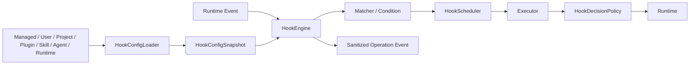

# Hooks

`@yiku/hooks` 是 Yiku 的生命周期策略执行层。它负责事件契约、配置编译、匹配、执行、决策、
显式信任和安全限制，不依赖 Agent SDK、Orchestrator、CLI 或 Atomic Flow。

## 数据流



## 事件

当前协议包含 30 个事件：

```text
SessionStart
Setup
InstructionsLoaded
UserPromptSubmit
UserPromptExpansion
MessageDisplay
PreToolUse
PermissionRequest
PostToolUse
PostToolUseFailure
PostToolBatch
PermissionDenied
Notification
SubagentStart
SubagentStop
TaskCreated
TaskCompleted
Stop
StopFailure
TeammateIdle
ConfigChange
CwdChanged
FileChanged
WorktreeCreate
WorktreeRemove
PreCompact
PostCompact
SessionEnd
Elicitation
ElicitationResult
```

Yiku Runtime 接入其中 28 个。`WorktreeCreate` 和 `WorktreeRemove` 当前返回明确的
`HOOK_CAPABILITY_UNAVAILABLE`，不静默跳过。

## 配置来源

Hook 来源按稳定优先级编译，但不同来源不互相覆盖；所有匹配 Handler 都参与决策：

- Managed Settings；
- `~/.yiku/config.yaml`；
- `<workspace>/config.yaml`；
- Plugin `hooks/hooks.json`；
- Skill/Agent Frontmatter；
- Runtime Callback。

Yiku 不读取其他产品的用户配置文件。兼容指事件和 Handler 协议，不表示共享配置目录。

配置示例：

```yaml
hooks:
  PreToolUse:
    - matcher: Bash|Edit
      hooks:
        - type: command
          command: node .yiku/hooks/check-policy.mjs
          timeout: 15
          statusMessage: Checking repository policy
  Notification:
    - matcher: permission_prompt
      hooks:
        - type: http
          url: https://hooks.example.com/events
          headers:
            Authorization: Bearer $HOOK_TOKEN
          allowedEnvVars: [HOOK_TOKEN]
```

`HookConfigLoader` 生成不可变 Snapshot。Reloader 只有在完整新配置编译成功后才替换当前
Snapshot，避免半更新状态。

## 匹配

Matcher 根据事件专属字段匹配 Tool、通知类型、Session 来源或其他能力。Condition 只读取允许的
结构化字段，不执行任意 JavaScript。配置顺序稳定，Scheduler 负责串行、并行和一次性语义。

## Executor

| 类型 | 运行方式 | 关键限制 |
| --- | --- | --- |
| `callback` | 宿主函数 | Deadline、AbortSignal |
| `command` | 子进程 stdin/stdout | 进程树、环境、字节和退出码 |
| `http` | HTTPS Transport | DNS、SSRF、Redirect、Header Env |
| `prompt` | `HookModelRunner` | Token、结构化输出、超时 |
| `agent` | `HookAgentRunner` | Turn、Tool、Token、递归深度 |
| `mcp` | `HookMcpInvoker` | Target allowlist、连接状态、重入 |

所有外部执行都有资源上限和取消传播。

## Command 协议

Command 从 stdin 读取一个事件 JSON，随后 stdin 关闭。stdout 可以为空、纯文本或兼容 JSON：

```js
let input = "";

process.stdin.setEncoding("utf8");
process.stdin.on("data", (chunk) => {
  input += chunk;
});
process.stdin.on("end", () => {
  const event = JSON.parse(input);
  if (event.hook_event_name === "PreToolUse" && event.tool_name === "Bash") {
    process.stdout.write(
      JSON.stringify({
        hookSpecificOutput: {
          hookEventName: "PreToolUse",
          permissionDecision: "deny",
          permissionDecisionReason: "Command violates repository policy",
        },
      }),
    );
  }
});
```

退出码：

- `0`：成功；
- `2`：按 Event Capability 映射为阻断、反馈或忽略；
- 其他：生成 `HOOK_EXECUTION_FAILED`。

stdout 仍需经过事件专属 Schema，退出码不能让非法输出生效。

## Decision

Handler 可以产生：

- `allow`
- `block`
- `defer`
- `no-op`
- `stop`

以及 `allow | ask | deny` 权限建议。`HookDecisionPolicy` 合并多个结果，拒绝冲突或非法升级。
Hook 的 `allow` 不能覆盖 Runtime、Workspace 或 Managed Policy 的 `deny`。

## Trust

Project、Local、Skill/Agent 和 User 来源的外部副作用 Handler 默认需要显式信任。Trust Key 包含：

- Source；
- Hook 和 Handler Hash；
- Executor 类型；
- Command、Origin 或 MCP Target；
- 环境变量和能力摘要。

配置变化后 Hash 变化，旧信任不再生效。CLI 管理入口：

```text
/hooks list
/hooks inspect <hook-id>
/hooks trust <hook-id>
/hooks revoke <hook-id>
```

Trust 只批准配置的 Handler，不代表批准 Agent 当前发起的具体命令。

## HTTP 与网络安全

- 仅 HTTPS；
- URL 不允许嵌入凭据；
- DNS 解析后拒绝私网、回环和受限地址；
- Redirect 每一跳重新校验；
- Header 只能引用显式 `allowedEnvVars`；
- 响应体有字节上限；
- MCP Target 必须通过 Server/Tool allowlist。

## 审计与脱敏

`HookEvents` 发出 `load`、`trust`、`dispatch` 和 `execute` 操作事件。审计 Observer 的错误不会
递归导致 Hook 失败。记录只包含 Hook ID、Source、Executor、状态、时长、计数和安全摘要；Secret、
完整环境和不可信大输出经过 Redactor。

## API 示例

```ts
import {
  CallbackHookExecutor,
  HookConfigCompiler,
  HookEngine,
  HookExecutorRegistry,
  HookSession,
  hookSource,
} from "@yiku/hooks";

const snapshot = new HookConfigCompiler().compile([
  {
    source: hookSource("runtime"),
    value: {
      hooks: {
        UserPromptSubmit: [
          {
            hooks: [
              {
                callback: () => ({ additionalContext: "Use project policy." }),
                name: "project-policy",
                type: "callback",
              },
            ],
          },
        ],
      },
    },
  },
]).snapshot;
const engine = new HookEngine({
  executors: new HookExecutorRegistry([new CallbackHookExecutor()]),
  snapshot,
});
const session = new HookSession({ engine });

await session.dispatch({
  cwd: process.cwd(),
  hook_event_name: "SessionStart",
  permission_mode: "default",
  session_id: "session-1",
  source: "startup",
  transcript_path: "/tmp/session-1.jsonl",
});
```

具体构造参数以 `@yiku/hooks` 根导出类型为准。

## 错误

稳定错误类别包括 Config、Matcher、Protocol、Execution、Timeout、Trust、Security、Capability
和 Decision Conflict。错误保留安全上下文，不泄漏 Secret 或完整不可信输出。

## 验证

```bash
corepack pnpm --filter @yiku/hooks build
corepack pnpm --filter @yiku/hooks test
corepack pnpm --filter @yiku/agent-orchestrator test
```

工程门禁见 [工程开发](../architecture/engineering.md)。
