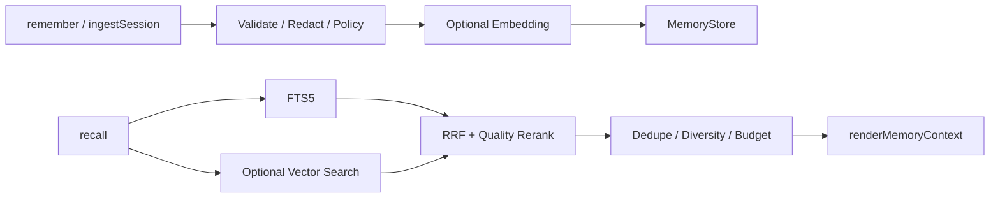
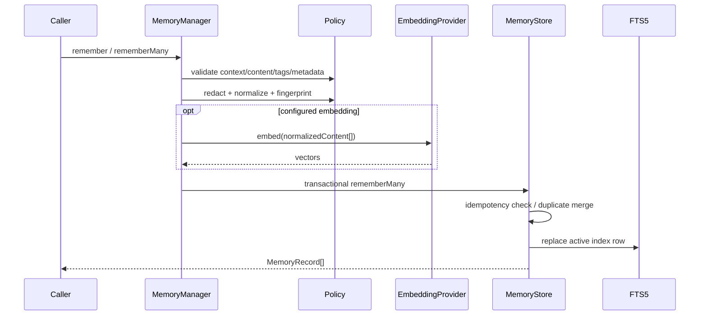
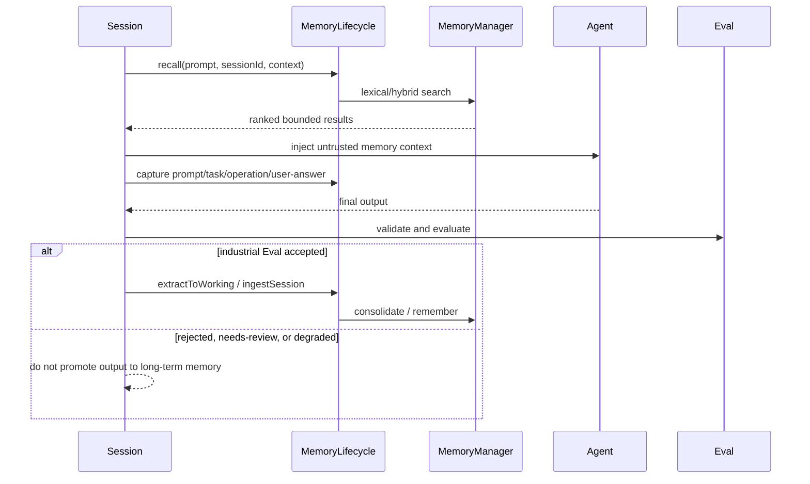

# Memories

`@yiku/memories` 为 Agent 提供持久、分域、可解释的长期记忆，并提供独立于 Agent SDK 的 Store、
Policy、检索、重排和上下文渲染能力。

## 数据流



## 分层与所有权

| 层次 | 组件 | 职责 |
| --- | --- | --- |
| Session 集成 | `MemoryRuntime` | 解析项目 Scope、创建 Store/Manager/Lifecycle、应用失败模式 |
| 生命周期 | `MemoryLifecycle` | 协调 Working Memory、提取、固化、统一搜索与遗忘 |
| 领域服务 | `MemoryManager` | 校验、脱敏、Embedding、检索、重排和长期记录操作 |
| 持久化 | `SqliteMemoryStore` | 事务、FTS5、向量 BLOB、Revision、TTL 和删除 |
| 短期状态 | `WorkingMemoryStore` | 保存当前 Session 的 Prompt、Task、操作与提取候选 |
| Provider 端口 | `MemoryExtractor` / `EmbeddingProvider` | 供应商无关的提取与向量接口 |
| 观测 | Memory Event / Atomic Atom | 只报告 Hash、阶段、计数、模式、耗时和错误码 |

`@yiku/memories` 不依赖 Agent SDK。Orchestrator 决定何时召回、提取与固化，CLI 决定默认文件路径
和 `best-effort`/`strict` 策略。

## Context 与隔离

每个操作必须提供 `MemoryContext`：

```ts
{
  namespace: "tenant-1",
  scope: {
    userId: "user-1",
    agentId: "code",
    projectId: "project-1",
    sessionId: "session-1",
  },
}
```

`namespace` 必需。Scope 字段可选，但查询只能在请求上下文允许的范围内发生。存储层使用稳定
Scope Key 和 Namespace Hash，避免不同用户、项目或 Agent 互相召回。

Scope 匹配采用“记录可比请求更宽、不能比请求更窄”的规则：记录中某字段为 `null` 时可应用于该
Namespace 下任意对应请求；记录中有具体 `userId`、`agentId`、`projectId` 或 `sessionId` 时，请求
必须携带相同值。`namespace` 始终精确匹配。该规则允许项目级事实进入项目内 Session，但阻止
Session 专属记录泄漏到另一个 Session。

## 写入

```ts
import {
  MemoryManager,
  SqliteMemoryStore,
} from "@yiku/memories";

const manager = new MemoryManager({
  store: new SqliteMemoryStore({
    filePath: "/absolute/path/to/memories.sqlite",
  }),
});

await manager.remember({
  confidence: 0.95,
  content: "Prefer concise engineering explanations.",
  context: {
    namespace: "tenant-1",
    scope: { projectId: "project-1", userId: "user-1" },
  },
  importance: 0.8,
  kind: "preference",
});
```

写入流程包括规范化、Secret 脱敏、内容限制、Policy、Fingerprint、幂等 Hash 和 Revision 检查。
相同幂等输入不会生成重复记录。

完整写入链路：



去重键为 `namespace + scopeKey + kind + fingerprint`。相同内容再次写入时合并 Tag/Metadata，取更高
Confidence/Importance，恢复为 Active 并增加 Revision。显式 `idempotencyKey` 在同一 Namespace 内
唯一；相同 Key 与相同 Hash 返回原记录，相同 Key 与不同内容返回
`MEMORY_IDEMPOTENCY_CONFLICT`。更新要求 `expectedRevision`，不匹配时返回
`MEMORY_REVISION_CONFLICT`。

## Memory Kind 与运行时分类

持久 Store 使用五种 `MemoryKind`，运行时投影为三类：

| 运行时分类 | 持久 Kind | 说明 |
| --- | --- | --- |
| `scenario` | `decision`、`episode` | 场景、经历和决策上下文 |
| `procedure` | `procedure` | 可重复步骤和操作知识 |
| `semantic` | `fact`、`preference` | 事实、概念和稳定偏好 |

分类只影响召回解释和 Atomic Flow，不改变 SQLite Schema 或查询 Scope。

## 记忆提取 JSON 契约

`OpenAIMemoryExtractor` 的输出必须是一个 JSON 数组，数组元素为 `MemoryDraft`。顶层没有
`data`、`memories` 等包装字段；没有值得保存的内容时返回空数组 `[]`。一次最多返回 20 条，
建议直接输出原始 JSON，不附加解释文本。实现也兼容一个完整的 `json` Markdown 代码块。

完整示例：

```json
[
  {
    "kind": "preference",
    "content": "用户偏好简洁、直接的工程说明。",
    "confidence": 0.96,
    "importance": 0.82,
    "tags": ["response-style", "user-preference"],
    "metadata": {
      "evidence": "explicit-user-statement",
      "appliesTo": "project"
    }
  },
  {
    "kind": "procedure",
    "content": "修改 CLI 后依次运行聚焦测试、lint 和 build。",
    "confidence": 0.9,
    "importance": 0.88,
    "expiresAt": "2027-01-01T00:00:00.000Z",
    "tags": ["cli", "verification"]
  }
]
```

### 字段

| 字段 | 必需 | 类型与约束 | 含义 |
| --- | --- | --- | --- |
| `kind` | 是 | `decision`、`episode`、`fact`、`preference`、`procedure` | 记忆的持久化类型 |
| `content` | 是 | 非空字符串；默认 Policy 最多 32,768 UTF-8 字节 | 独立、可复用的记忆正文 |
| `confidence` | 是 | `0` 到 `1` 的有限数值 | 提取结果可信度；默认低于 `0.55` 的 Draft 不会固化 |
| `importance` | 是 | `0` 到 `1` 的有限数值 | 对未来任务的价值，用于召回质量排序 |
| `expiresAt` | 否 | 可解析的日期字符串，推荐 RFC 3339 / ISO 8601 | 记忆过期时间；写入时规范化为 ISO 8601 |
| `tags` | 否 | 非空字符串数组；默认最多 32 项，每项最多 128 UTF-8 字节 | 检索和过滤标签；写入时去重并排序 |
| `metadata` | 否 | JSON 对象；默认最多 16,384 UTF-8 字节、嵌套深度最多 8 | 补充来源、适用范围或证据等结构化信息 |

Schema 是严格的：不接受表格之外的字段。`metadata` 的值只能是标准 JSON 值，即字符串、有限
数值、布尔值、`null`、数组或嵌套对象，不能包含 `undefined`、函数或运行时对象。

### Kind 选择

| Kind | 适用内容 | 示例 |
| --- | --- | --- |
| `decision` | 已确定且未来需要保持一致的选择及其约束 | “项目统一使用 Biome，不引入 ESLint。” |
| `episode` | 对未来有复用价值的历史事件、结果或经验 | “上次升级依赖后需要重新生成锁文件。” |
| `fact` | 稳定、可验证的事实或项目属性 | “项目要求 Node.js 22.13.0 及以上版本。” |
| `preference` | 用户、团队或项目的稳定偏好 | “用户偏好简洁的工程说明。” |
| `procedure` | 可重复执行的步骤、命令或排障方法 | “先运行受影响 Package 测试，再运行根级门禁。” |

提取时只保留持久、可复用的信息，不保存临时进度、完整 Prompt/Response、原始推理、Secret、
凭据或一次性状态。每条 Draft 应表达一个清晰事实，避免把多个无关结论拼接在同一条
`content` 中。

### 校验与固化

1. Extractor 校验顶层数组、最大数量和每个 Draft 的严格 Schema；
2. 默认 Policy 丢弃 `confidence < 0.55` 的 Draft；
3. 候选先以 `turn-extract` 来源进入 Working Memory；
4. Consolidate 执行内容规范化、Secret 脱敏、Policy 校验和幂等处理；
5. 合格记录写入长期 Memory Store。

任意 Draft 结构非法、输出不是有效 JSON、数量超过 20，或者模型未正常完成时，本次提取整体
失败。具体是否影响 Session 由 `memory.failureMode` 的 `best-effort` 或 `strict` 配置决定。

## Recall

```ts
const recalled = await manager.recall({
  context: {
    namespace: "tenant-1",
    scope: { projectId: "project-1", userId: "user-1" },
  },
  query: "How should responses be written?",
});
```

未提供 `EmbeddingProvider` 时使用 SQLite FTS5。注入 Provider 后启用词法与向量混合检索：

1. 各通道产生 Candidate；
2. Reciprocal Rank Fusion 合并排名；
3. `DefaultMemoryReranker` 结合相关性、质量、时效和重要性；
4. 去重并保持 Kind/来源多样性；
5. 按字符预算生成结果；
6. `renderMemoryContext()` 输出安全、带边界的 Agent Instructions。

召回结果包含分数分解和选择原因，便于审计。

## Store

### SQLite

`SqliteMemoryStore` 提供：

- WAL；
- Schema 版本与迁移；
- FTS5；
- 可选向量 BLOB；
- 事务写入；
- Revision 冲突；
- TTL、软删除、硬删除和清理。

需要 Node.js `>=22.13.0`。Node 22 的 `node:sqlite` 可能输出实验性警告。

### SQLite 结构

Schema Version 当前为 `1`，核心表和索引如下：

| 结构 | 关键字段 | 作用 |
| --- | --- | --- |
| `memories` | `id`、`namespace`、四级 Scope、`kind`、`content` | 主记录 |
| 内容派生字段 | `normalized_content`、`fingerprint` | 确定性去重 |
| 治理字段 | `status`、`expires_at`、`revision`、`access_count` | 生命周期与并发控制 |
| 幂等字段 | `idempotency_key`、`idempotency_hash` | 重试安全 |
| 向量字段 | `embedding`、`embedding_model`、`embedding_dimensions` | 可选语义检索 |
| `memories_fts` | `id`、`content`、`tags` | FTS5 词法检索 |
| 唯一约束 | Namespace + Scope Key + Kind + Fingerprint | 防止同域重复 |
| 部分唯一索引 | Namespace + Idempotency Key | 保证幂等键唯一 |

初始化设置 `foreign_keys=ON`、`journal_mode=WAL`、`synchronous=NORMAL`、
`temp_store=MEMORY` 和默认 5 秒 Busy Timeout。新数据库文件尽力设置为 `0600`。迁移在
`BEGIN IMMEDIATE` 事务内执行；磁盘 Schema 高于 Runtime 支持版本时拒绝打开。

写入、更新、软删除、硬删除和 Prune 都在事务内同步维护 FTS。软删除把 `status` 设为
`deleted` 并从 FTS 移除；硬删除直接移除主记录和 FTS 行；Prune 删除已过期记录以及早于 Cutoff
的软删除记录。

### In-memory

`InMemoryMemoryStore` 与 SQLite Store 使用相同契约，适合测试和短生命周期宿主。Store
Conformance 测试确保两者核心行为一致。

## Working Memory

`InMemoryWorkingMemoryStore` 和 Session Working Memory 保存当前任务的短期信息。它与长期
Memory 分开：

- 不自动跨 Session 晋升；
- 可以从 Prompt、Tool 或 Agent 输出捕获；
- 进入上下文时有独立字符预算；
- 完成或取消时由 Runtime 决定保留或清理。

独立使用 `MemoryLifecycle` 时默认 Working Store 只在进程内存在。CLI 使用
`SessionWorkingMemoryStore`，把记录写入版本化 Session State，因此可以随 Session 恢复。每个
Session 最多保留最近 500 条 Working Memory。

状态变化：

```text
capture -> active
active + valid draft -> consolidated -> longTermMemoryId
active + below threshold -> discarded
active + write failure -> active (reported in result.pending)
forget working record -> physically removed from Working Store
```

Capture 以 `source + normalizedContent` 在当前 Session 内去重。统一搜索默认同时查询 Working、
Scenario、Procedure 和 Semantic；Working 结果优先，再按分数合并，并通过 Fingerprint 去重和字符
预算截断。

## 生命周期

`MemoryManager` 支持长期记录操作：

- `remember`
- `recall`
- `search`
- `update`
- `forget`
- `prune`
- `ingestSession`

`MemoryLifecycle` 在此之上提供 `captureWorking`、`extractToWorking`、统一 `search`、
`consolidate`、统一 `forget`、`status` 与 `clearWorking`。`forget` 支持软删除和硬删除；`prune`
物理删除已过期记录以及早于 Cutoff 的软删除记录。`consolidate` 使用稳定 Idempotency Key 把
Working Draft 写入长期 Store，重复内容由 Store 合并并保留 Revision 语义。

## Session 集成

Orchestrator 的顺序：

1. 在 Agent 构建前 Recall；
2. 把有界 Memory Context 注入 Instructions；
3. 记录 Working Memory；
4. Agent 成功后执行可选 Extraction；
5. 通过 `MemoryExtractor` 生成结构化 Draft；
6. 经相同 Policy 写入。



未启用工业 Evaluation Coordinator 时，成功且通过领域 Validator 的输出可直接进入配置的 Memory
Extraction，再运行兼容 Eval。启用工业评估时，只有 Completion Decision 为 `accepted` 才自动提取
长期记忆；`degraded` 虽可完成 Session，但不会自动晋升本轮输出。

配置：

```yaml
memory:
  enabled: true
  extraction: true
  failureMode: best-effort
```

`best-effort` 记录降级但不停止 Session；`strict` 把 Memory 基础设施错误作为运行失败。
Session 同时发出结构化 `memory_operation` Progress Event，并投影为同名
`AgentMessageEnvelope` Payload。事件只包含 Namespace Hash、操作、阶段、耗时、计数、模式和
错误码，不包含 Prompt、回复或 Memory 正文；因此持久 Session JSONL、Trace 和宿主回调可以
核对同一 Memory 生命周期。

CLI：

```text
/memory status
/memory search <query>
/memory consolidate
/memory forget <id>
```

## Atomic Flow

主要原子：

```text
memory.recall
memory.search
memory.fts-search
memory.query-embedding
memory.vector-search
memory.rerank
memory.context-inject
memory.extract
memory.write
memory.forget
memory.prune
memory.consolidate
memory.working
memory.working-capture
memory.scenario
memory.procedure
memory.semantic
```

Payload 只包含 Scope Hash、计数、耗时和摘要，不写入完整 Secret 或不受限内容。

## 安全

- 内置 Redactor 处理常见 Secret；
- Policy 限制大小、Kind、日期、Tag 和 Metadata；
- Agent 召回内容使用明确分隔和不可信数据提示；
- Namespace 与 Scope 在 Manager 和 Store 两层校验；
- Embedding 错误按配置降级或失败；
- Store 错误不包含原始敏感内容。

## 失败与降级

| 情况 | `best-effort` | `strict` / Store 契约 |
| --- | --- | --- |
| Recall/Extraction/Write 失败 | 发出错误事件并继续主流程 | 暂停或失败 Session |
| Embedding 失败且 Policy 为 `lexical` | 回退 FTS，事件标记 Degraded | 不适用 |
| Embedding 失败且 Policy 为 `error` | 抛出类型化错误 | 抛出类型化错误 |
| Vector Candidate 超过 `maxVectorScan` | 跳过向量通道，使用词法结果 | 事件带 `MEMORY_VECTOR_SCAN_LIMIT` |
| Revision 冲突 | 不覆盖新版本 | `MEMORY_REVISION_CONFLICT` |
| Schema 过新或迁移失败 | 不打开数据库 | 显式错误，不重建用户数据 |
| AbortSignal 触发 | 停止当前操作 | `MEMORY_ABORTED` |

Memory 的观测 Handler 和 Atomic Flow Sink 失败不能改变 Memory 行为；但实际 Store、Policy、
Extractor 和必需 Embedding 失败必须按配置显式处理。

## 主要导出

- `MemoryManager`
- `SqliteMemoryStore` / `InMemoryMemoryStore`
- `InMemoryWorkingMemoryStore`
- `DefaultMemoryPolicy`
- `DefaultMemoryReranker`
- `renderMemoryContext` / `renderMemorySearchContext`
- `MemoryLifecycle`
- `MemoryStore` / `MemoryExtractor` / `EmbeddingProvider`
- Memory Atom、类型和类型化错误

调用方创建的 Manager 必须调用 `close()`。

## 验证

```bash
corepack pnpm --filter @yiku/memories build
corepack pnpm --filter @yiku/memories test
```

存储路径见 [配置与存储](../atoms/configuration-and-storage.md)。
