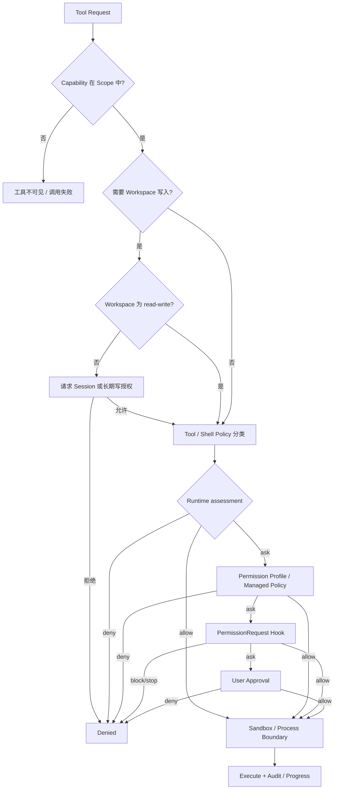

# Permission 与执行边界

Yiku 的 Permission 体系不是一个布尔开关，而是 Capability Scope、Workspace 授权、工具静态策略、
Permission Profile、Hook、人工或 Managed Policy 审批以及 OS Sandbox 的交集。授权只能在既有硬边界
内放行操作，不能让项目配置、Skill、Hook 或 Agent 自行扩权。

## 权限层次

| 层次 | 所有者 | 作用 | 失败语义 |
| --- | --- | --- | --- |
| Capability Scope | Orchestrator | 决定工具是否对当前 Agent 可见 | 工具不可调用 |
| Workspace Authorization | CLI / Host | 决定 Workspace 是只读还是读写 | 写入前请求升级或拒绝 |
| Workspace Boundary | `@yiku/agent-code` | Real Path、额外根目录、符号链接与路径逃逸检查 | 硬拒绝 |
| Tool/Shell Policy | `@yiku/agent-code` | 将操作分类为 `allow`、`ask`、`deny` 并声明 Capability/Risk | `deny` 不进入审批 |
| Permission Profile | `@yiku/cli` | 按 Policy、Command、MCP 和 Network 规则细化决策 | `deny` 优先 |
| Permission Hook | Orchestrator + Hooks | 在需要审批时执行 `PermissionRequest` / `PermissionDenied` | `block`/`stop` 拒绝 |
| User / Managed Policy | CLI / Host | 对剩余 `ask` 给出一次、Session 或持久决策 | 无处理器时拒绝 |
| Shell Sandbox | `@yiku/sandbox` | 在 OS 层限制文件系统、网络、进程能力 | 平台不可用时显式失败或受控降级 |

## 决策流程



核心不变量：

- Runtime `deny` 在调用 Profile、Hook 或人工处理器前生效，后续层不能覆盖；
- 同时命中多条 Command/MCP 规则时，任一 `deny` 优先，否则使用最具体的通配规则；
- Hook 的 `allow` 只能处理已进入 Hook 的请求，不能覆盖先前硬拒绝；
- Workspace 写授权不等于允许删除、发布、提权或任意 Shell；这些操作仍需各自策略；
- Sandbox 是执行边界，不是审批系统；审批通过后仍必须在 Sandbox 允许的范围内运行。

## Permission Request 协议

Input：

```json
{
  "toolName": "bashTool",
  "toolCallId": "call-17",
  "workspaceId": "7e813fc4b3...",
  "action": "execute command",
  "normalizedAction": "recursively remove workspace paths",
  "subject": "rm -rf ./dist",
  "policyId": "recursive-force-rm",
  "capabilities": ["process.execute", "workspace.delete"],
  "risk": "high",
  "reason": "recursively force-removes files or directories",
  "metadata": {
    "isolation": "sandbox",
    "network": "allow"
  }
}
```

Output：

```json
{
  "decision": "allow",
  "scope": "session",
  "reason": "User approved the permission for this session."
}
```

`PermissionResponse.decision` 只有 `allow` 或 `deny`。`ask` 是执行前的 Assessment，不是最终响应。
允许范围为：

| Scope | 生命周期 | 存储 |
| --- | --- | --- |
| `once` 或省略 | 当前请求 | 不持久化 |
| `session` | 当前 CLI 进程内相同规范请求 | 内存 Set |
| `persistent` | 后续 Session 的同一 Policy | 活动 Profile 的 `policyRules` |

Session Grant Key 包含去重排序后的 Capability、Normalized Action、Policy ID、Risk、Tool、
Workspace ID 和目标。被截断的命令不能生成 Session Grant Key，避免把不完整显示内容作为授权依据。

## Permission Profile

配置文件位于 `~/.yiku/permission/global.json`。默认目录权限为 `0700`，文件权限为 `0600`，更新
使用临时文件、File Sync、原子 Rename 和目录 Sync。示例：

```json
{
  "_migrationVersion": 2,
  "activeProfile": "default",
  "profiles": {
    "default": {
      "displayName": "Default",
      "filesystem": { "default": "read_only" },
      "network": { "default": "allow" },
      "authorization": { "ttlDays": 7 },
      "shellSandbox": {
        "enable": true,
        "onRestrict": "request_permission_retry_sandbox"
      },
      "approval": {
        "reviewer": "user",
        "policyRules": {
          "known-low-risk-command": "allow",
          "workspace-file-write": "allow"
        },
        "commandRules": {
          "git push *": "deny"
        },
        "mcpRules": {
          "github/search_*": "allow",
          "github/delete_*": "deny"
        }
      }
    }
  },
  "resourceAuthorization": {
    "filesystem": {
      "readOnly": [],
      "readWrite": []
    },
    "network": {
      "allow": [],
      "deny": []
    }
  }
}
```

规则值只能是 `allow`、`ask`、`deny`。Command 与 MCP 规则支持 `*`；空 Pattern 不匹配。命令在
匹配前会折叠空白。Profile 解析失败、活动 Profile 缺失或 Schema 非法时 fail-closed；只有文件不存在
时才生成默认 Profile。旧 v1 的内置 `default` Profile 会迁移为 Network Default `allow`，自定义
Profile 的网络决策保持原值。

当前 CLI 实际消费范围：

| 字段 | 当前行为 |
| --- | --- |
| `activeProfile`、`approval.*Rules` | 交互模式匹配 Tool Policy、Command 和 MCP Target |
| `network.default` | 处理仅包含 `process.execute`/`network.connect` 的请求 |
| `authorization.ttlDays` | 计算 Workspace 授权过期时间 |
| `resourceAuthorization.filesystem` | 启动时恢复 Workspace Read-only/Read-write Trust |
| `filesystem.default`、`shellSandbox.*`、`resourceAuthorization.network` | 当前仅校验和持久化，尚未直接驱动 CLI Runtime 装配 |

因此不能只修改尚未接线的 Profile 字段来假设运行边界已经变化。Shell Isolation/Network 仍由
Toolset 注入的 Sandbox 与 Shell Policy 决定。非交互模式使用 `external` Policy Mode：Profile 的
`deny` 仍可收紧，但 `allow` 不能替代显式 Managed Policy Grant。

## Workspace 授权

Workspace 授权记录同时保存词法路径与 `rootRealPath`，查询时以规范化真实路径匹配。默认 TTL 为
7 天，过期记录不生效；同一路径升级为读写时移除旧的只读记录。交互 CLI 在启动前获取授权，
非交互 CLI 没有现存授权时直接退出。

`WorkspaceAccessController` 在只读 Session 首次发生编辑或 Shell 写入时请求升级。并发升级请求复用
同一个 Promise；允许后当前 Controller 变为 `read-write`。持久化选择由 CLI 写回 Profile Store，
Session 选择只影响当前进程。

## Shell 策略

`ShellPolicy` 使用结构化 Shell Parser 检查命令段、重定向、动态值和路径，而不是只做字符串前缀判断。
主要分类：

| 决策 | 典型 Policy | 例子 |
| --- | --- | --- |
| `deny` | `host-privilege`、`disk-format`、`raw-device-write`、`remote-shell-pipe`、路径逃逸 | `sudo`、`mkfs`、`curl ... \| sh` |
| `ask` | 删除、移动、Git 丢弃、递归权限变更、发布、Opaque/Complex Shell | `rm -rf`、`git reset --hard`、`pnpm publish` |
| `allow` | 已分类只读命令、安全构建命令、有限 Workspace 写入、策略允许的网络 | `rg`、`git status`、`pnpm test`、`touch` |

命令引用 Workspace 外路径、动态路径或符号链接逃逸时硬拒绝。Yiku Home 只有被宿主显式加入的
`~/.yiku` 根可访问，不等于整个用户 Home 可访问。

## Sandbox 与降级

- macOS 使用 `sandbox-exec` Profile；
- Linux 使用 rootless `bubblewrap`，只读挂载 Runtime 路径并按 Workspace Access 挂载工作目录；
- Windows 在实现 Job Object/ACL Sandbox 前返回不可用错误；
- `@yiku/sandbox` 自身不做命令解析、审批或进程管理；
- Code Terminal 可以由宿主显式提供 `HostPolicyShellSandbox` 作为降级边界，降级后会重建
  `ShellPolicy` 并发出 `runtime_boundary_changed`；
- Verification Command 要求其声明的只读或隔离执行约束，不把普通 Session 授权当作验证隔离。

## Hooks、MCP 与非交互模式

需要审批的 Tool Request 先进入 `PermissionRequest` Hook。Hook `block`/`stop` 立即拒绝；Hook
`allow` 在未启用 `forceHumanApproval` 时可以批准；其他情况交给用户处理器。拒绝后再发
`PermissionDenied` Hook。Hook Trust 使用独立 Store，不能用 Permission Profile 替代。

MCP 副作用使用 `mcp-external-side-effect` Policy，并可由 `mcpRules` 按 `server/tool` 匹配。Skill
和 Agent 配置还必须先通过 MCP Target Allowlist 与 Capability Scope。

非交互模式不弹出审批。它使用 Workspace Trust 加显式 Managed Policy：

- Deny Rule 优先；
- 所有请求 Capability 都必须被精确授权；
- Credential、External Request、Publish 和 MCP Grant 必须带 Resource；
- Resource 不支持通配符；
- 截断命令、未知 Capability 或缺失 Grant 保持 `ask`，最终作为需要人工输入而失败；
- 成功授权必须写入私有 NDJSON Audit；Audit 写入失败时不执行高风险操作。

## 故障处理

| 情况 | 行为 |
| --- | --- |
| Runtime Policy 为 `deny` | 抛出 `PermissionDeniedError`，不调用审批处理器 |
| 无审批处理器 | 默认 `deny` |
| Profile 文件损坏 | 启动失败，需显式 Reset |
| Workspace 授权过期 | 视为未授权 |
| Sandbox 启动失败 | 返回稳定错误；是否降级由调用方决定 |
| Permission Hook 拒绝 | 返回 Deny，并发出 `PermissionDenied` |
| 长期授权写入失败 | 当前操作不得伪装为已持久授权 |
| Agent/Skill 请求扩权 | 在 Capability 或 Workspace 边界拒绝 |

## 验证

```bash
corepack pnpm --filter @yiku/agent-code test
corepack pnpm --filter @yiku/sandbox test
corepack pnpm --filter @yiku/agent-orchestrator test
corepack pnpm --filter @yiku/cli test
```

存储位置见 [配置与存储](../atoms/configuration-and-storage.md)，工具所有权见
[Code Agent](code-agent.md)，跨包边界见 [包边界](../architecture/package-boundaries.md)。
