# Research Agent

`@yiku/agent-research` 定义证据型 Research Agent、Research Skill、Evidence/Claim Ledger、报告
验证、Research Eval 和领域 Flow。运行、取消、Session 和 Subagent 由 Orchestrator 负责。

## 运行条件

- 模型与 Provider 支持 OpenAI Responses API；
- Provider 支持 Web Search；
- 配置有效 API Key；
- 需要实时检索时允许 Provider 网络访问。

## 标准创建

标准宿主通过 `ResearchAgentFactory` 注册并运行：

```ts
import {
  createRegisteredAgent,
  ResearchAgentFactory,
  run,
} from "@yiku/agent-orchestrator";

const model = "your-web-search-capable-model";
const created = createRegisteredAgent(
  new ResearchAgentFactory({ searchContextSize: "medium" }),
  {
    agentName: "Research Agent",
    handoffs: [],
    model,
    tools: [],
    workspaceDir: process.cwd(),
  },
  {
    agentId: "research",
    agentKey: "research",
    agentType: "research",
  },
);

const result = await run(created.agent, "研究 Agent 可观测性的最新实践", {
  apiKey: process.env.OPENAI_API_KEY ?? "",
  model,
});
```

直接构造 `ResearchAgent` 适合自定义宿主；Yiku Session 应优先使用 Factory，以自动获得稳定身份、
领域 Observer 和输出验证。

## Research Skill

`createResearchSkill()` 为每次构造创建独立的：

- Web Search Tool；
- `EvidenceLedger`；
- `ResearchClaimLedger`；
- `recordEvidenceTool`；
- `recordClaimTool`；
- 研究 Prompt 和停止条件。

Ledger 不在不同 Run 之间共享，避免并发研究互相污染。

这里的 `Research Skill` 是 Research Agent 的领域能力组合，不是磁盘上的通用 `SKILL.md`。
标准 CLI Session 会把两者组合：Research Factory 创建 Web Search、Evidence 和 Claim 工具，
Orchestrator 再注入通用 Skill Runtime 工具。

## 加载通用 Skills

Research Agent 在 CLI 中使用与 Code Agent 相同的发现目录和优先级：

```text
@yiku/agent-orchestrator/src/skills/builtin/<name>/SKILL.md
~/.yiku/skills/<name>/SKILL.md
<workspace>/.yiku/skills/<name>/SKILL.md
```

加载链：

```mermaid
flowchart LR
    files["SKILL.md"] --> discovery["discoverSkills()"]
    discovery --> runtime["SkillRuntime Catalog"]
    runtime --> runtimeSkill["createSkillRuntimeSkill(research)"]
    runtimeSkill --> scope["CapabilityScope: skills"]
    scope --> agentGraph["Agent Graph"]
    agentGraph --> factory["ResearchAgentFactory"]
    factory --> agent["ResearchAgent"]
```



1. CLI 启动时发现并解析 `SKILL.md`，按 `project > user > builtin` 去重。
2. Catalog 常驻名称、描述、来源、Digest 和 `agentTypes`，正文不默认进入 Prompt。
3. Research Agent 获得 `skillListTool`、`skillInspectTool` 和 `skillRunTool`。
4. 自动匹配时先 Inspect 正文；`/skill-name` 显式激活时，Runtime 先校验
   `agentTypes` 和 MCP Policy。
5. `skillRunTool` 生成不可变 Snapshot，并用 `agentType: research` 在独立只读 Worker 中执行。

可由 Research Agent 运行的 Skill 必须显式声明：

```markdown
---
name: source-audit
description: 核验研究来源的权威性、独立性和时效性。
agentTypes:
  - research
---

先检查原始来源，再检查独立交叉来源；证据不足时保留不确定性。
```

省略 `agentTypes` 时默认仅支持 `code`，Research 激活会返回
`SKILL_AGENT_TYPE_MISMATCH`。List 和 Inspect 可以展示不兼容 Skill 的元数据，但不能激活或运行。
Research 默认不加载 Code Workspace 工具。

`playground/research-agent` 是另一种低层宿主：它直接创建 `ResearchAgentFactory`，页面中的
Quick/Research/Deep Skill 是宿主预设与附加指令，不扫描上述通用 `SKILL.md` 目录。

## Evidence

`EvidenceLedger` 保存规范化来源记录：

- URL 和规范 URL；
- 标题、来源域和来源类型；
- 摘要与支持内容；
- 发布时间、访问时间和时效信息；
- 与 Claim 的支持或反驳关系；
- 验证状态和 Metadata。

URL 经过 `canonicalResearchUrl()` 规范化，用于去除可忽略差异和识别重复来源。默认最多保存
50 个规范 URL；超过上限或输入无效时抛出类型化错误。

## Claim

`ResearchClaimLedger` 保存结构化论断：

- 稳定 Claim ID；
- Claim 文本；
- 重要性；
- 支持 Evidence ID；
- 反驳 Evidence ID；
- 冲突和验证状态。

默认最多保存 200 个 Claim。报告中的重要事实应先进入 Claim Manifest，再由 Citation Validator
检查引用完整性。模型不能仅通过生成看似合法的 URL 绕过 Ledger。

## 报告验证

`validateResearchReport()` 结合报告、Evidence 和 Claim Manifest，确定性检查：

- Citation Precision 和 Recall；
- Unsupported Claim；
- 来源权威性；
- 来源时效性；
- 独立域多样性；
- 冲突和反证覆盖；
- 报告结构。

无法确定的语义蕴含可以交给可选 Judge，但 Judge 不替代结构化证据。验证失败保留原报告和诊断，
便于 Eval、CLI 和 Observatory 展示。

## Research Evals

Research Provider 提供：

- `ResearchClaimCitationEvaluator`
- `ResearchContradictionEvaluator`
- `ResearchDiversityEvaluator`
- `ResearchFreshnessEvaluator`
- `ResearchReportStructureEvaluator`
- `ResearchSourceAuthorityEvaluator`
- `createResearchEvalProfile()`
- `createResearchEvaluators()`

默认配置要求至少两个独立来源域，时效窗口为 180 天，质量阈值为 0.8。配置可以按 Profile 调整，
但不能把缺失 Evidence 当作通过。

## 领域 Flow

`ResearchFlowTracker` 在标准 Factory 中自动发射：

| Atom | 含义 |
| --- | --- |
| `research.plan` | 研究计划 |
| `research.query` | 查询构造 |
| `research.search` | Web Search |
| `research.evidence-record` | 证据记录 |
| `research.corroborate` | 交叉核验与反证 |
| `research.synthesize` | 综合分析 |
| `research.citation-validate` | 引用验证 |
| `research.report` | 最终报告 |

调用方不需要监听 SDK Progress Event 手工重建流程。领域原子和通用 Tool/Model/Agent 原子进入
同一个 Atomic Flow Run。

## Prompt 约束

默认 Prompt 要求：

- 先明确研究问题和范围；
- 优先原始、官方和权威来源；
- 记录 Evidence 后再形成关键 Claim；
- 主动搜索反证和冲突；
- 区分事实、推断和未知；
- 对证据不足结论降级；
- 使用可验证 Citation；
- 达到停止条件后生成结构化报告。

`loadResearchPrompt()` 优先读取 Package 内 Markdown 模板，缺失或为空时使用内置 Fallback。

## Playground

`playground/research-agent` 提供多轮 Research UI、Thread/Turn Store、Evidence 展示、领域 Flow
和 Observatory 深链。它是集成示例，不是 `@yiku/agent-research` 的公共 API。

开发：

```bash
corepack pnpm --filter @yiku/research-agent-playground dev
```

## 主要导出

- `ResearchAgent`
- `createResearchSkill`
- `EvidenceLedger`
- `ResearchClaimLedger`
- `recordEvidenceTool`
- `recordClaimTool`
- `canonicalResearchUrl`
- `validateResearchReport`
- `ResearchFlowTracker`
- `RESEARCH_ATOMS`
- Research Eval Profile、Evaluator 和 Artifact Helper

## 边界与失败

- Research Agent 不提供 Code Workspace 写工具。
- Web Search 结果必须经过 Evidence 记录，搜索文本本身不是可信证据。
- URL 去重不证明来源独立；独立域和来源类型由 Evaluator 单独判断。
- Provider 不支持 Web Search 时创建或运行失败。
- Ledger 上限、非法 URL、未知 Evidence 引用和重复 ID 显式失败。
- 输出验证失败阻止标准 Session 完成；诊断报告仍保留。
- 网络和 Provider 失败不伪造报告成功。

## 验证

```bash
corepack pnpm --filter @yiku/agent-research build
corepack pnpm --filter @yiku/agent-research test
```

评估策略见 [Evals](evaluations.md)，运行投影见
[Atom 目录](../atoms/atom-catalog.md)。
