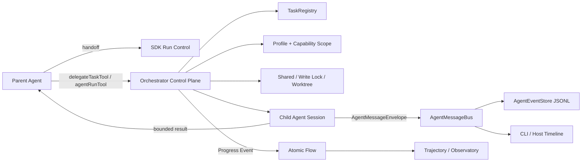
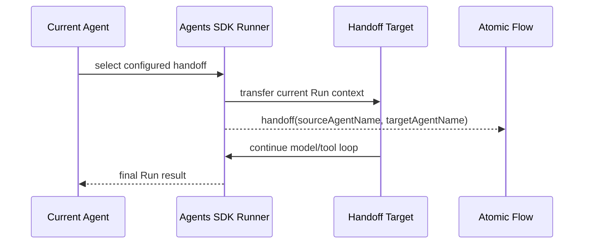
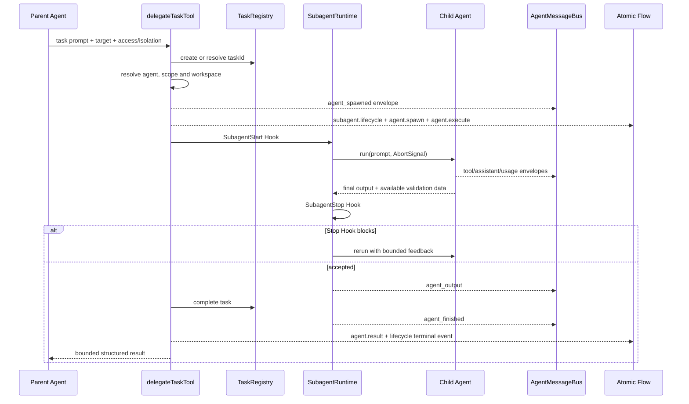
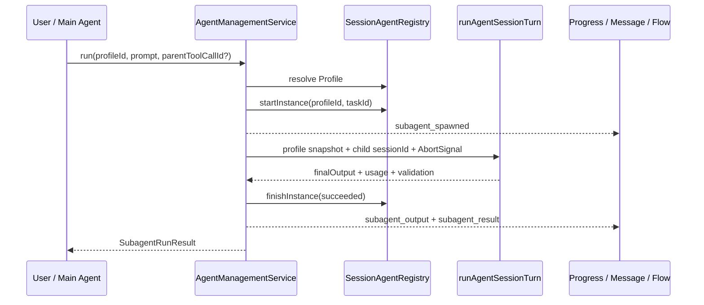

# Agent-to-Agent 与 Subagents

Yiku 提供 Handoff、配置 Delegate 和 Session Subagent 三种协作机制。它们共享 Agent Factory 和
运行观测能力，但生命周期、控制权和持久化语义不同。

## 机制选择

| 机制 | 定义位置 | 生命周期 | 父 Agent 行为 | 适合场景 |
| --- | --- | --- | --- | --- |
| Handoff | Agent Graph | 当前 SDK Run | 转移控制权 | 专业路由 |
| Delegate | `agents.items.*.delegates` | 当前 Tool Call | 等待结果后继续 | 并行分析、审查、研究 |
| Session Subagent | Profile Store | Profile 按来源持久，Instance 每次运行 | 显式创建和运行 | 可复用专家角色 |

## Agent-to-Agent 总体模型

Yiku 的 Agent-to-Agent（A2A）协作分为控制面、数据面和观测面：



- Handoff 在一个 SDK Run 内转移当前发言 Agent，不创建独立 Task 或子 Session；
- Delegate 以配置中的 Agent Key 和 `TaskRegistry` Task 运行；Session Subagent 以持久 Profile 和
  `SessionSubagentInstance` 运行。两者都生成 Agent、Task 和消息关联 ID；
- Agent 不直接访问另一个 Agent 的隐藏状态。输入通过 Prompt/Task 传递，输出通过结构化结果返回；
- Capability、权限、Hook、Workspace 和领域 Validator 在子 Agent 的运行边界重新应用；是否运行
  独立工业 Eval 由具体调用路径配置；
- A2A 消息用于关联与展示，Atomic Flow 用于 Run 级事实和 Replay，两者不是彼此的替代品。

## 三种协作流程

### Handoff



Handoff Target 必须出现在当前 Agent 的 `handoffs` 中。Graph 构建会拒绝环；目标节点使用自己的
Agent Type、Model、Skill 和领域 Tool 配置。Handoff 不返回一个可供父 Agent继续推理的
`DelegateTaskResult`，因为控制权已经转移。

### Configured Delegate



`SubagentStop` 的 `block` 不表示终态失败，而是把 Reasons 作为反馈再次调用子 Agent；取消、异常和
最终成功才关闭 Lifecycle。父级 AbortSignal 传给子运行和 Worktree 操作。当前 Reader
`ConcurrencyLimiter` 与 `WorkspaceWriteLock` 的等待队列本身不可取消；排队任务取得执行权后，
子运行必须再次观察同一个 Signal。

### Session Subagent



Session Subagent 不经过 `SubagentRuntime` 的 `SubagentStart`/`SubagentStop` 重试循环；它由
`AgentManagementService` 管理 Profile 与 Instance，并运行一个带独立 `agentSessionId` 的 Agent
Turn。失败或取消时先把 Instance 写为对应终态，再发出 `subagent_result`。

## 配置 Delegate

```yaml
agents:
  default: code
  items:
    code:
      type: code
      model: code
      skills: [code, delegate]
      delegates: [reviewer, researcher]
    reviewer:
      type: code
      model: code
      skills: [code]
    researcher:
      type: research
      model: research
      skills: []
```

`delegateTaskTool` 只允许调用当前 Agent 声明的目标。输入包含任务、访问模式和隔离策略；结果包含
目标 Agent、输出、验证摘要和 Worktree 信息。

Input：

```json
{
  "agent_key": "reviewer",
  "prompt": "Review the permission boundary and report concrete findings",
  "access_mode": "read-only",
  "isolation": "shared",
  "task_id": "task-review-permission"
}
```

只有 `agent_key` 和 `prompt` 必需；`access_mode` 默认为 `read-only`。只读任务不能请求
`worktree`。读写任务在配置了 Worktree Manager 且未显式选择 `shared` 时优先创建 Worktree；
自动 Worktree 不可用时可以回退共享写入，显式 `worktree` 失败则不回退。

Output：

```json
{
  "taskId": "task-review-permission",
  "output": "Review complete...",
  "changedFiles": [],
  "verification": {
    "passed": true,
    "checks": [
      { "key": "scope", "passed": true, "summary": "No boundary escape" }
    ]
  }
}
```

Worktree 模式还可返回 `worktreeId` 和 `patch`。只读 Delegate 如果报告文件变更，整个调用失败。

## Delegate 访问模式

### 只读

- 可以读取 Workspace；
- 不能修改文件；
- 适合审查、搜索和分析；
- 受 `maxParallelReaders` 限制。

### 共享读写

- 与父 Agent 使用同一 Workspace；
- 写操作通过 `WorkspaceWriteLock` 串行化；
- 不能保证不同 Agent 的语义修改无冲突；
- 适合明确划分文件范围的短任务。

### Worktree

- 在独立 Git Worktree 中执行；
- 返回变更摘要和 Patch；
- 父 Agent 决定是否应用结果；
- 关闭时清理临时 Worktree。

Worktree 要求有效 Git 仓库和可创建的临时路径。未提交变更、子模块、外部生成文件和大型仓库会
增加 Patch 与清理风险。

## Session Profile

Session Subagent 由 `SessionSubagentProfile` 描述：

- `profileId` 与名称；
- Agent Type、模型和指令；
- Purpose 与 Invocation Mode；
- Workspace Scope；
- Skill Snapshot；
- 项目或用户来源；
- 创建与更新时间。

运行中的 Profile 持有完整 Skill Snapshot。项目或用户级 Markdown Profile 当前只持久化 Skill
名称，进程重启时从当前 Catalog 重建 Snapshot；对应 `SKILL.md` 被修改、删除或 Shadow 后，既有
持久 Profile 可能改变语义或加载失败。这是当前持久化边界，不应把 Markdown Profile 当作已冻结
的能力制品。

Profile 与 Instance 分离：

- Profile 是可复用定义；
- Instance 是某次运行状态；
- 同一 Profile 可以创建多个 Instance；
- Instance 记录 Agent ID、Task、状态、输出和错误。

状态关系：

```text
Profile 1 ---- * Instance 1 ---- 1 Task
                          \---- 1 Child Agent Session
```

Profile 最多 12 个；名称按不区分大小写去重。运行中的 Profile 不能删除。Instance 状态为
`running -> succeeded | failed | cancelled`，终态记录 `endedAt`，失败或取消可记录安全错误摘要。

## 创建和管理

CLI：

```text
/agent-new
/agents
```

持久化 Profile 会以 `/agent:<name>` 进入 `/` 补全候选；命令后的文本作为任务 Prompt，缺省时
使用 Profile 的 Deliverable。

Agent 侧可以通过内置 `agents` Skill 请求创建、列出、运行和删除 Profile。底层由：

- `AgentCreationBroker`
- `SessionAgentRegistry`
- `AgentManagementService`
- `SubagentRuntime`
- `ProjectAgentProfileStore` / `UserAgentProfileStore`

共同实现。

Profile 输入经过 Schema、Agent Type、模型、Skill 和 Workspace Scope 校验。项目内容不能创建
超出宿主 Policy 的权限。

## Invocation Mode

Profile 可以限制调用方式：

- `manual`：只有用户或 Main Agent 明确点名 Profile 时运行；
- `proactive`：当前用户交流匹配 Purpose/Scope/Trigger 时，Main Agent 可以主动调用；显式点名
  同样有效。

Purpose 用于描述审查、实现、研究等职责，不直接授予 Capability。实际能力始终来自 Agent Type、
Skill Snapshot、MCP allowlist 和 Workspace Access 的交集。

## 并发

`TeamRuntime` 管理多个 Worker，`TaskRegistry` 管理任务状态。主要规则：

- Read-only Worker 可以并行，数量受 Runtime 预算限制；
- Shared Writer 通过单写锁执行；
- Worktree Writer 隔离文件系统，但仍共享模型、网络和外部服务预算；
- 父任务取消时向关联子运行传播 AbortSignal；已经进入 Reader/Writer 等待队列的调用仍需等到
  取得执行权后由子运行观察取消；
- 子任务输出必须在聚合前完成自身 Validator。

并行不会自动解决逻辑依赖。父 Agent 应为子任务提供明确 Scope、输入、完成条件和输出格式。

## 输出验证

子 Agent 仍执行其 Factory 提供的领域 Output Validator。Configured Delegate 返回
`DelegateTaskResult`：`output`、`taskId`、`changedFiles`，以及可选的 `patch`、`worktreeId` 和
`verification`。Session Subagent 返回 `SubagentRunResult`：`agentId`、`profileId`、`taskId`、
`finalOutput`、`status`，以及可选的 `usage` 和 `validation`。

CLI 创建的 Session Subagent 当前显式关闭独立工业 Eval，避免把子运行误当成顶层完成门禁；领域
Validator 仍然生效。Configured Delegate 可以由宿主的 Run Adapter 返回 Verification 摘要。失败
结果不能作为已验证 Deliverable，但可以通过错误事件和 Task 状态保留诊断。

## 权限与 Hook

- 子 Agent 不继承未声明 Skill；
- Workspace Scope 只能缩小父范围；
- 只读子 Agent 写入时仍需权限升级；
- 高风险 Shell、MCP 和外部 Hook 继续经过宿主审批；
- Subagent Start/Stop、Tool、Task 和 Worktree 生命周期进入 Hook Engine；
- Hook `allow` 不能覆盖 Runtime `deny`。

## Atomic Flow

标准协作事件包括：

- `agent.profile`
- `agent.spawn`
- `agent.execute`
- `agent.result`
- `subagent.lifecycle`
- `task.snapshot`

子 Agent 使用稳定 `agentId`、`taskId`、`parentToolCallId` 和 Parent Instance 关联到顶层 Run。领域
Observer 发射的 Research Atom 或自定义 Atom 继续进入同一 Flow。

## A2A 消息协议

跨 Agent 事件的规范传输对象是 `AgentMessageEnvelope`：

```json
{
  "eventId": "event-42",
  "occurredAt": "2026-08-20T10:00:00.000Z",
  "sessionId": "session-root",
  "agentId": "agent-child-1",
  "agentSessionId": "session-root.agent.agent-child-1",
  "parentAgentId": "root",
  "parentToolCallId": "call-17",
  "taskId": "task-review-permission",
  "toolCallId": "read-3",
  "payload": {
    "kind": "tool_output",
    "toolName": "readTool",
    "title": "Read file",
    "summary": "Read packages/agents/code/src/permission/types.ts",
    "effect": "read"
  }
}
```

### 关联字段

| 字段 | 语义 | 稳定范围 |
| --- | --- | --- |
| `eventId` | 单条消息身份 | 全局唯一 |
| `sessionId` | 顶层父 Session | 整个 A2A 树一致 |
| `agentId` | 当前执行实例 | 单次子 Agent Run |
| `agentSessionId` | 子 Agent 的逻辑 Session | 单次子 Agent Run |
| `parentAgentId` | 直接父 Agent | 当前父子关系 |
| `parentToolCallId` | 触发 Delegate/Agent Run 的 Tool Call | 用于挂接父时间线与 Flow Parent |
| `taskId` | 业务任务身份 | Task Registry 生命周期 |
| `toolCallId` | 子 Agent 内的 Tool Call | 一次工具调用 |
| `payload.profileId` | 可复用 Agent 定义 | 跨多个 Instance；不属于 Envelope 顶层字段 |

这些 ID 不可互换。特别是 `profileId` 不是运行实例，`agentSessionId` 不是顶层 `sessionId`，
`parentToolCallId` 只表达调用关联，不表达 Task 所有权。

### Payload 生命周期

子 Agent 使用以下专用 Payload：

```text
agent_spawned -> agent_output -> agent_finished
```

运行中还可发送 `assistant_delta`、`reasoning`、`tool_called`、`tool_output`、`usage`、
`memory_operation` 和 `runtime_boundary_changed`。`agent_output` 是最终可消费文本，
`agent_finished` 是终态；失败或取消时可以没有 `agent_output`，但必须有终态和可选错误摘要。

`AgentProgressEvent` 中的兼容名称为：

| Envelope Payload | Progress Event | Atomic Flow |
| --- | --- | --- |
| `agent_spawned` | `subagent_spawned` | `subagent.lifecycle`、`agent.spawn`、`agent.execute` Start |
| `agent_output` | `subagent_output` | `agent.execute` Delta |
| `agent_finished` | `subagent_result` | `agent.execute`/`subagent.lifecycle` End 或 Error、`agent.result` |

适配器在两种表示之间投影。Message Bus 已直接发布原生子 Agent Envelope 时，不应再把同一 Legacy
Progress Event 重复发布为第二条生命周期消息。

### 顺序与投递

- Message Bus 对同一个 `agentId` 串行发布，保证该 Agent 的消息顺序；
- 不同 Agent 的队列可以并行，因此不能用到达顺序推断跨 Agent 因果；
- Required Sink 在 Optional Sink 前执行，Required Sink 失败会让发布失败；
- Optional Sink 与 Listener 失败只进入诊断，不改变 Agent 结果；
- `AgentEventStore` 以 `0600` 追加 JSONL，并按发布队列写入；
- Atomic Flow 在顶层 Run 内提供严格递增 `sequence`，跨系统关联应使用 ID，不应借用墙上时钟；
- Payload 和 Atomic Summary 应有界。完整大结果通过 Artifact、Patch 或 Store Reference 传递。

## 数据所有权与传播

| 数据 | 生产者 | 消费者 | 持久化/传递方式 |
| --- | --- | --- | --- |
| Task Prompt | Parent Agent / User | Child Agent | Tool Input 或 Agent Run Input |
| Profile / Skill Snapshot | Agent Registry | Child Factory | Session State + Snapshot |
| Tool Progress | Child Runtime | Host / Timeline | `AgentMessageEnvelope` |
| Final Output | Child Agent | Parent Agent | `DelegateTaskResult.output` / `SubagentRunResult.finalOutput` |
| Validation / Verification | Child Factory / Run Adapter | Parent Agent | 结构化 Result 字段 |
| Changed Files / Patch | Worktree Manager | Parent Agent | Worktree Result，不自动应用 |
| Lifecycle Fact | Orchestrator | Replay / Observatory | Atomic Flow Event |

父 Agent 不自动获得子 Agent 的完整 Transcript、Memory 或内部推理。需要复用的信息必须进入最终输出、
结构化 Artifact/Verification，或由明确的 Memory 生命周期写入；这避免隐式共享状态和权限旁路。

## 失败与恢复

| 情况 | 行为 |
| --- | --- |
| 未知 Delegate | 配置或 Tool 校验失败 |
| Reader 达到并发上限 | 进入 FIFO 等待队列；当前队列等待本身不可取消 |
| Writer 冲突 | 等待写锁，可被取消 |
| 显式 Worktree 创建失败 | 子任务失败，不回退共享写入 |
| 自动选择 Worktree 但 Git 不可用 | 回退 Shared，并继续受单写锁保护 |
| 子 Agent Validator 失败 | 保留诊断，结果标记失败 |
| 父任务取消 | 传播取消并关闭子资源 |
| 进程在外部副作用后退出 | 恢复时进入 Review |
| Profile Snapshot 损坏 | Session 恢复失败，不静默重建 |

## 使用建议

- 代码审查和仓库理解默认使用只读 Delegate。
- 修改任务按目录或文件所有权拆分，避免共享写入重叠。
- 需要隔离生成物或高风险修改时使用 Worktree。
- Research 使用 Research Agent Type，不给 Code Agent 伪造 Web Evidence。
- Profile 指令应包含职责、输入、停止条件、输出格式和禁止行为。
- 子任务结果在父 Agent 使用前检查 Validator、Eval 和 Artifact。

## 公共入口

- `delegateTaskTool`
- `AgentCreationBroker`
- `SessionAgentRegistry`
- `AgentManagementService`
- `SubagentRuntime`
- `TeamRuntime`
- `WorktreeManager`
- Profile、Instance、Task 和 Result 类型

## 验证

```bash
corepack pnpm --filter @yiku/agent-orchestrator test
corepack pnpm --filter @yiku/cli test
```

Runtime 关系见 [Runtime 与编排](../architecture/runtime-and-orchestration.md)，执行授权见
[Permission 与执行边界](permissions.md)，事件事实与派生视图见
[Atomic Flow](../atoms/atomic-flow.md) 和 [Trajectory](../atoms/trajectory.md)。
