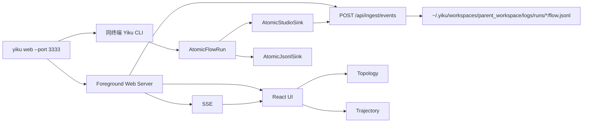

# Yiku Agent Observatory

Yiku Agent Observatory 是 Yiku CLI 的本地运行智能观测面，用于展示 Session、Agent、
Skill、Subagent、Memory、Telemetry 和 Quality 事件。它是 `@yiku/agent-studio` 的默认
Atomic Flow 插件与开箱预设，正式实现位于 `packages/agent-observatory`。

## 启动

构建后从任意工作区执行：

```bash
yiku web --port 3333
yiku web --stop
```

页面、API、SSE 和事件接收共用 `http://127.0.0.1:3333`。启动命令创建前台 Web Server，
确认健康后检查是否已有 Observatory 页面连接；仅在没有现有页面时自动打开浏览器，然后在同一
终端进入交互会话。退出终端会关闭 Web 服务。运行历史写入
`~/.yiku/workspaces/<父目录>_<workspace>[_<8-char-hash>]/logs/runs/`。
`yiku web --stop` 只用于清理已注册的旧后台观察器。

开发 Studio 本身时可执行：

```bash
corepack pnpm --filter @yiku/agent-observatory dev
```

开发模式继续使用 Vite 和独立 API 进程；正式 `yiku web` 使用 Node 单端口托管构建产物。

验证自定义页面、API、Slot 和主题插件时执行：

```bash
corepack pnpm --filter @yiku/agent-observatory-playground dev
```

## 数据流



CLI 优先使用显式 `YIKU_ATOMIC_STUDIO_URL`，否则自动发现本机注册服务。每次顶层 Prompt
对应一个唯一 Run，长任务 Stage 在同一 Run 内保持连续 Sequence。

## 功能

- Session Control、Agent Execution、Memory Systems、Capability Orchestration、Telemetry、
  Quality Gates 六个分区；
- 固定节点来自各能力包的真实原子目录，自定义 Evaluator 等扩展原子动态显示；
- `research.*` 等未知 Agent 命名空间进入动态 Agent Domain；
- 固定展示 Skill resolve/activate/execute 与 Agent profile/spawn/execute/result；
- Runtime 和 Deep View；
- 动态原子节点，以及由 `@yiku/flow-graph` 提供的避障、全局优化正交连线与诊断；
- 三列全视区布局，以及原子切换时的定向流光和到达脉冲；
- Run 终态停止流动效果；`flow.trace` 默认关闭，开启后仅投影完成、失败和跳过事件；
- 可折叠运行历史和事件面板；
- `USER` / `TEST` 关注标记与文字图例；
- 点击 Guide 打开右侧 Drawer，查看领域、路径、状态、Replay 和完整固定原子目录；
- Inspector 单独展示 profileId、agentId、taskId、workerId 和 digest correlation；
- Header 与 History 区分 Agent Run 和 Control Run；
- Events、计数、Event Inspector 和回放步进仅展示功能事件；原始 Trace/Trajectory 仍可驱动画布；
- 单步回放、倍速播放和 Live 模式；
- Topology / Trajectory 双视图，共享同一 Replay 和选中 Sequence；Topology 布局在页面生命周期
  内缓存，刷新页面后重新计算；
- Trajectory 按 Turn 展示 Instance 父子层级、状态、摘要和耗时；Overview 使用固定 45px
  事件块横向滚动，Hover 可查看开始时间和执行时长，并可从历史事件返回最新状态；
- Event Log 在运行和回放时跟随当前事件，支持快速定位当前运行节点；
- CLI Run 自动置顶、手动选择锁定和持久化历史。

页面支持 `?runId=<id>&view=trajectory` 深链。指定 Run 后会关闭自动跟随最新 Run，等待该 Run
进入 Registry 并直接打开 Trajectory。Research Playground 使用 Turn ID 作为 Run ID，并通过
同一 `AtomicStudioSink` 投递 `research.*` 原子。

页面只负责观测，不从浏览器发起或取消 Agent。事件投递失败只降低观测能力，不会停止来源
CLI。服务仅绑定回环地址，它是本地开发工具，不是远程授权边界。

## 扩展

客户端插件：

```ts
import { agentObservatoryClientPlugin } from "@yiku/agent-observatory/plugin/react";

const plugin = agentObservatoryClientPlugin({ path: "/flow" });
```

服务端插件：

```ts
import { agentObservatoryServerPlugin } from "@yiku/agent-observatory/plugin/server";
```

兼容 Server 仍从 `@yiku/agent-observatory/server` 导出 `ApiServer`、
`ApiServerOptions` 和 `resolveWebAssetsDir()`。`ApiServerOptions.plugins` 可以追加编译期
Server 插件，其 Route 自动挂载到 `/api/plugins/<plugin-id>/*`。旧 `/api/runs/*`、
`/api/ingest/events` 和 `atomic-flow` SSE 保持不变。

通用插件契约与最小宿主参见
[Agent Studio README](../agent-studio/README.md)。完整 Workspace 扩展示例位于
[`playground/agent-observatory`](../../playground/agent-observatory)。

通用节点、端口、障碍物、SVG/Canvas/React 接入和边界 Case 参见
[Flow Graph](../../docs/atoms/flow-graph.md)。
