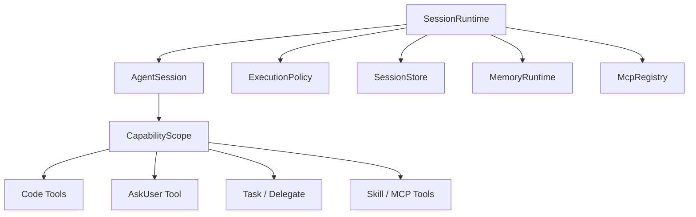

# @yiku/agent-orchestrator

`@yiku/agent-orchestrator` 负责组装并运行 Yiku Agent 图，是 CLI 调用的唯一执行包。它把配置、
Agent 定义、Skill、Memory、Hook、Runtime、Trace 和 Evals 连接成一次完整会话。

## 运行链路

```mermaid
flowchart LR
    host["CLI 或宿主"] --> runtimeRoot["SessionRuntime"]
    runtimeRoot --> session["AgentSession"]
    runtimeRoot --> state["Session State / Lease"]
    runtimeRoot --> scope["CapabilityScope"]
    config["@yiku/config"] --> session
    memory["@yiku/memories"] --> session
    session --> graph["Agent 与 Handoff 图"]
    graph --> runtime["run()"]
    runtime --> sdk["OpenAI Agents SDK"]
    graph --> observer["AgentRunObserver 可选"]
    observer --> flow["@yiku/atomic-flow"]
    session --> hooks["HookSession"]
    hooks --> runtime
    runtime --> flow["@yiku/atomic-flow"]
    flow --> trace["@yiku/trajectory 投影"]
    session --> evals["@yiku/evals"]
    evals --> flow
```

## 核心职责

- 解析模型配置和 Agent 图配置。
- 构建 SDK 原生 `Agent` Handoff 图。
- 执行 `run(agent, input, options)`。
- 发出进度事件和操作事件。
- 为 Agent Graph 分配稳定 Run 内身份，并路由领域 Observer。
- 以 Atomic Flow 为唯一事实源生成 `AgentRunResult.trajectory`。
- 在真实生命周期边界消费 `HookDecision`。
- 通过 `@yiku/trajectory` 持久化会话 Trace。
- 按需通过 `@yiku/memories` 召回和写入长期记忆。
- 在成功输出后运行默认 Evals，并把 Scorecard 和 Gate 写回同一 Atomic Flow。
- 用阶段预算、持久检查点和 Lease 支持长程任务恢复。
- 通过 CapabilityScope 装配 Code、Task、Delegate 和 MCP 工具。
- 将 Permission 和 User Question Handler 按单次 Submit 注入 Agent 工具。
- 通过 Prompt Segment、来源/Digest、结构化消息和模型调用前 Tool Result 过滤维护上下文信任边界。

## 使用示例

```ts
import { runAgentSession } from "@yiku/agent-orchestrator";
import { YikuPaths } from "@yiku/config";
import { MemoryManager, SqliteMemoryStore } from "@yiku/memories";

const paths = new YikuPaths({ workspaceDir: process.cwd() });
const manager = new MemoryManager({
  store: new SqliteMemoryStore({
    filePath: paths.workspaceMemoryFilePath,
  }),
});

try {
  const output = await runAgentSession("review this repository", {
    agentKey: "code",
    cwd: process.cwd(),
    memories: {
      context: {
        namespace: "local-user",
        scope: {
          projectId: process.cwd(),
        },
      },
      manager,
    },
  });
} finally {
  await manager.close();
}
```

Memory 为可选能力，调用方负责管理 `MemoryManager` 的生命周期。

CLI 使用 `MemoryRuntime` 管理默认 SQLite Store 生命周期；直接使用 `runAgentSession()` 的宿主
仍负责传入并关闭自己的 Manager。

## 长程 Session

`SessionRuntime` 是 CLI 的组合根：



每个 Stage 完成后持久化 History、Task、预算和副作用摘要。SDK `RunState` 只用于同进程续跑，
不写入 State、Trace 或 Memory。跨进程恢复使用 `--resume` / `--continue` 和稳定阶段边界。

未知外部副作用进入 `needs-review`；Runtime 不把外部服务纳入本地事务，因此不提供
exactly-once 保证。

## 主要导出

- `AgentSession`
- `SessionRuntime`
- `SessionStore`
- `ExecutionPolicy`
- `CapabilityScope`
- `McpRegistry` / `McpServerFactory`
- `MemoryRuntime`
- `AgentFactoryRegistry`
- `CodeAgentFactory` / `ResearchAgentFactory`
- `createRegisteredAgent` / `AgentRunObserver`
- `AgentCreationBroker` / `SessionAgentRegistry` / `AgentManagementService`
- `WorktreeManager`
- `RUNTIME_ATOMS` / `RUNTIME_ATOM_DEFINITIONS`
- `runAgentSession`
- `run`
- `resolveAgentGraph`
- `resolveModelConfig`
- `DefaultSkillRegistry`
- `discoverSkills` / `resolveBuiltinSkillsDirectory`
- `SkillInstallationService`
- `HookAudit`
- `OperationHookAdapter`（旧 API 迁移期）
- Runtime、Session、Agent、Skill 和 Hook Adapter 类型

`runAgentSession()` 是单轮兼容入口。交互宿主应直接持有 `AgentSession`，多轮调用 `submit()`，
并在退出时调用 `close()`。旧 `dispatchHooks()` 已废弃，不再进入 `run()` 主链。

自定义 Factory 不实现 Observer 也会得到通用 Runtime Flow。需要领域语义时返回
`createRunObserver(context)`；Observer 使用 Orchestrator 提供的 Flow，不创建 Sink、不关闭
Flow。输出验证结果写入 `AgentRunResult.outputValidation`，标准 Session 据此失败，但不会重复
执行 Validator。

Skill Discovery 默认合并包内、用户级和项目级 `SKILL.md`，优先级为
`project > user > builtin`。Code Agent 随包提供计划、TDD、系统调试、代码审查、安全审查和
完成前验证，以及 Skill 发现和创建八个按需工作流。Research Agent 保留 Orchestrator 注入的
Skill Runtime 工具，并按 `agentTypes: [research]` 校验激活与隔离 Worker。

## 验证

```bash
corepack pnpm --filter @yiku/agent-orchestrator build
corepack pnpm --filter @yiku/agent-orchestrator test
```

## 相关文档

- [Runtime 与编排](../../docs/architecture/runtime-and-orchestration.md)
- [Atomic Flow](../../docs/atoms/atomic-flow.md)
- [Agent-to-Agent 与 Subagents](../../docs/features/subagents.md)
- [Context Compact](../../docs/features/context-compaction.md)
- [Permission 与执行边界](../../docs/features/permissions.md)
- [Memories](../../docs/features/memories.md)
- [Evals](../../docs/features/evaluations.md)
- [Trajectory](../../docs/atoms/trajectory.md)
- [Hooks](../../docs/features/hooks.md)
- [包边界](../../docs/architecture/package-boundaries.md)
