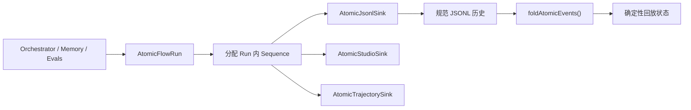

# @yiku/atomic-flow

`@yiku/atomic-flow` 是 Yiku 的 Run 级原子事件协议。它统一事件顺序、Span 生命周期、
Sink 分发、JSONL 持久化、Studio 投递和确定性回放。

## 数据流



## 主要导出

- `AtomicFlowRun`
- `AtomicSpan`
- `AtomicJsonlSink`
- `AtomicStudioSink`
- `FLOW_ATOMS`
- `FLOW_ATOM_DEFINITIONS`
- `isTraceObservationEvent`
- `readAtomicFlowEvents`
- `foldAtomicEvents`
- Atom、Event、Edge、Sink、Snapshot 和 Fold 类型

## 基本使用

```ts
import { homedir } from "node:os";
import { join } from "node:path";
import { AtomicFlowRun, AtomicJsonlSink } from "@yiku/atomic-flow";

const flow = new AtomicFlowRun({
  runId: "run-1",
  sinks: [
    new AtomicJsonlSink({
      filePath: join(
        homedir(),
        ".yiku",
        "workspaces",
        "parent_workspace",
        "logs",
        "atomic-runs",
        "run-1",
        "flow.jsonl",
      ),
    }),
  ],
});

const turn = flow.start({
  atom: {
    key: "loop.turn",
    kind: "loop",
    label: "Loop Turn",
    level: "runtime",
  },
  iteration: 1,
});

turn.end();
await flow.close();
```

## 投递到 Studio

调用方可以把自有 `AtomicFlowRun` 投递到本地 Yiku Agent Observatory：

```ts
import { AtomicFlowRun, AtomicStudioSink } from "@yiku/atomic-flow";

const flow = new AtomicFlowRun({
  runId: crypto.randomUUID(),
  trace: true,
  sinks: [
    new AtomicStudioSink({
      endpoint: "http://127.0.0.1:3333",
      project: {
        id: "checkout-service",
        name: "Checkout Service",
      },
      run: {
        kind: "agent",
        prompt: "Review the checkout flow",
        sessionId: "session-1",
      },
    }),
  ],
});
```

`AtomicStudioSink` 只接受回环 HTTP 地址。Project 元数据随事件发送，Run 元数据在第一次
成功投递时发送。`trace` 默认关闭；设为 `true` 后，Sink 的 Trace/Trajectory Receipt 和
`flow.sink-error` 才进入 Flow。无论是否开启 Trace，Sink 失败都不会中断源 Run，Snapshot
仍标记为 `degraded`。Run `kind` 支持 `agent` 和 `control`。

## 协议约束

- Sequence 在单个 Run 内严格递增。
- 稳定的 `atom.key` 标识流程图节点。
- 唯一 Instance ID 标识每次重复执行。
- `AtomicJsonlSink` 完整写入事件，只为 `end/error/skipped` 外部事件返回 Trace Receipt；
  仅当 Flow 开启 `trace` 时，该 Receipt 才进入事件序列。
- 内部 Sink Receipt 只持久化一次，不再递归生成 Receipt。

## 验证

```bash
corepack pnpm --filter @yiku/atomic-flow build
corepack pnpm --filter @yiku/atomic-flow test
```

## 相关文档

- [Atomic Flow](../../docs/atoms/atomic-flow.md)
- [Flow Graph](../../docs/atoms/flow-graph.md)
- [可观测性](../../docs/architecture/observability.md)
