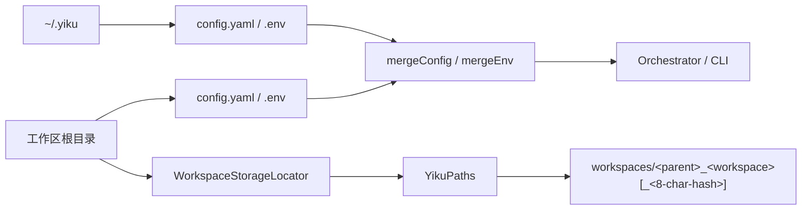

# @yiku/config

`@yiku/config` 提供 Yiku 的配置读取、分层合并和 Home 路径解析能力。全局来源为
`~/.yiku/config.yaml`、`~/.yiku/.env`，项目根 `config.yaml` 覆盖同名 YAML 键；`.env`
则相反，全局 `~/.yiku/.env` 覆盖同名项目键，避免项目占位密钥遮蔽全局配置。

## 配置流



## 主要导出

- `ConfigStore`
- `WorkspaceStorageLocator`
- `loadEnvFile`
- `loadModelsConfig`
- `getDefaultModelsConfigPath`
- `mergeConfig`
- `mergeEnv`
- `serializeModelsConfig`
- `YikuPaths`
- `EnvVars`
- `ModelsConfig`
- 加载选项类型

## 使用示例

```ts
import {
  getDefaultModelsConfigPath,
  loadEnvFile,
  loadModelsConfig,
  mergeConfig,
  YikuPaths,
} from "@yiku/config";

const globalConfig = loadModelsConfig({
  configPath: getDefaultModelsConfigPath(),
});
const localConfig = loadModelsConfig({
  configPath: `${process.cwd()}/config.yaml`,
});
const config = mergeConfig(globalConfig, localConfig);
const env = loadEnvFile({ cwd: process.cwd() });
const paths = new YikuPaths({ workspaceDir: process.cwd() });
```

文件不存在时返回空对象。`loadEnvFile()` 只读取明确文件或当前目录，不向父目录搜索。
`WorkspaceStorageLocator` 使用 Workspace Real Path 声明 Home 运行目录。首个 Workspace 使用
`<parent>_<workspace>`；可读名称已被其他 Real Path 占用或元数据不可用时，追加 8 位
SHA-256 路径摘要。最终路径为
`~/.yiku/workspaces/<parent>_<workspace>[_<8-char-hash>]`，每个目录的 `workspace.json`
记录所有者 Real Path。

旧版带 `yiku_` 前缀的 Workspace Storage 目录不会被自动扫描、复用或迁移。

## 验证

```bash
corepack pnpm --filter @yiku/config build
corepack pnpm --filter @yiku/config test
```

## 相关文档

- [配置与存储](../../docs/atoms/configuration-and-storage.md)
- [Runtime 与编排](../../docs/architecture/runtime-and-orchestration.md)
