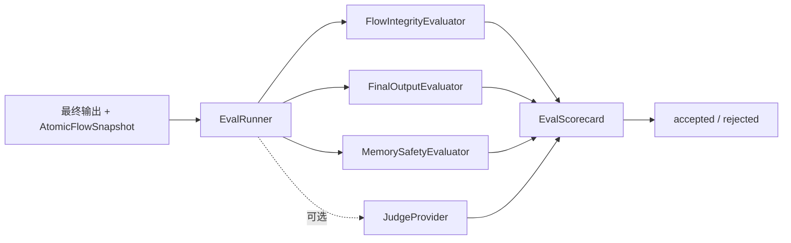

# @yiku/evals

`@yiku/evals` 为已完成的原子 Agent Run 提供与模型供应商无关的工业级评估能力。它读取最终
输出、Artifact、Receipt、Research Evidence 和 `AtomicFlowSnapshot`，生成版本化、可解释、
可持久化的 Scorecard，但不执行 Agent、不决定 Session 终态，也不改写原始输出。

## 评估流程



## 主要导出

- `EvalRunner`
- `EvalPlanner`
- `EvalScheduler`
- `EvaluatorRegistry`
- `FileEvalResultStore`
- `createDefaultEvalProfile`
- `createEvaluationScorecard`
- `createEvalBaseline` / `compareEvalBaseline`
- `FlowIntegrityEvaluator`
- `FinalOutputEvaluator`
- `MemorySafetyEvaluator`
- `EVAL_ATOMS`
- `EVAL_ATOM_DEFINITIONS`
- `JudgeProvider`
- 评估结果和 Scorecard 类型

`EvalRunner` 默认检查事件顺序、父实例完整性、未闭合实例、最终输出和 Memory 摘要安全。
宿主可以注入 LLM Judge。Yiku Agent Observatory 只观测宿主发出的 Eval Atom；当前 CLI
Session 等待 Scorecard 和 Gate 完成后再关闭 Flow，并在 Observatory Metadata 中记录为
`blocking`。`EvalMode` 的 `async | blocking` 目前是观测兼容类型，不是 `EvalRunner` 调度选项。

`scorecard.passed` 是否阻断业务完成由宿主决定。当前 `AgentSession` 等待评估并记录 Gate，但
兼容 SDK 默认保持 Observe；CLI 通过 Orchestrator `CompletionPolicy` 使用 Enforce，支持
`accepted`、`degraded`、`retry`、`needs-review` 和 `rejected`，并允许一次自动修复。

## 工业评测

```ts
import {
  createDefaultEvalProfile,
  EvalPlanner,
  EvalScheduler,
  EvaluatorRegistry,
} from "@yiku/evals";

const registry = new EvaluatorRegistry(evaluators);
const profile = createDefaultEvalProfile({ mode: "enforce" });
const plan = new EvalPlanner({ registry }).createPlan({
  profile,
  runId,
  taskId,
});
const scorecard = await new EvalScheduler({ registry }).run(plan, context);
```

核心约束：

- 单 Run 最多 32 个 Check，默认并发 4；
- 单进程默认最多 8 个并发 Run；
- Check 支持 Required/Optional、严重度、依赖 DAG、超时、权重和证据要求；
- `error`、`not-run` 和缺失分数按 0 计分；
- Blocker、未知副作用和 Artifact 漂移不能被平均分抵消；
- AbortSignal 传播到排队、Evaluator、Verification Command 和 Repair；Store Commit 完成自身的
  原子写入；
- 确定性 Score Digest 不包含运行时长噪声。

## 持久化

`FileEvalResultStore` 使用私有权限、跨进程 Lock、临时文件/目录、文件同步、原子重命名和目录
同步。Plan、Attempt、Scorecard、Evidence Index、Decision 和 Baseline 都是不可变记录；相同
Digest 重试幂等，不同 Digest 返回冲突。

默认路径由宿主设置为：

```text
~/.yiku/workspaces/<workspace>/evals
```

## 使用示例

```ts
import { EvalRunner } from "@yiku/evals";

const runner = new EvalRunner({
  passThreshold: 0.8,
});

const scorecard = await runner.run({
  finalOutput,
  flow: atomicFlow.snapshot(),
});
```

单个 Evaluator 抛错时会生成失败结果；中止信号和无效配置会抛出 `EvaluationError`。

## 验证

```bash
corepack pnpm --filter @yiku/evals build
corepack pnpm --filter @yiku/evals test
corepack pnpm --filter @yiku/evals performance
```

## 相关文档

- [Evals](../../docs/features/evaluations.md)
- [Atomic Flow](../../docs/atoms/atomic-flow.md)
