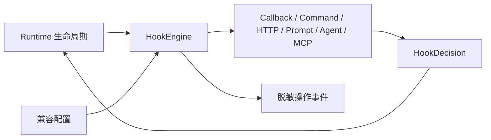

# @yiku/hooks

`@yiku/hooks` 是 Yiku 的生命周期策略执行层，负责 Hook 契约、配置、匹配、执行、决策、信任和
审计。它不依赖 Agent SDK、Orchestrator、CLI、Trajectory 或 Atomic Flow。

## 边界



当前生命周期契约包含 30 个 Hook 事件。本轮 Runtime 集成延期
`WorktreeCreate`、`WorktreeRemove`，宿主必须返回明确的 Capability 诊断，不能静默跳过。

## 配置来源

- Managed Settings
- `~/.yiku/config.yaml` 的 `hooks`
- `<workspace>/config.yaml` 的 `hooks`
- Plugin `hooks/hooks.json`
- Skill/Agent Frontmatter
- Runtime Callback

不同来源不相互覆盖，所有匹配 Handler 都会按稳定配置顺序参与决策。

## 执行器

| 类型 | 宿主依赖 | 主要限制 |
| --- | --- | --- |
| callback | 无 | Runtime 来源、deadline |
| command | Node 子进程 | 进程树、字节上限、退出码 |
| HTTP | HTTPS Transport | SSRF、DNS、Redirect |
| prompt | `HookModelRunner` | 结构化输出、Token、超时 |
| agent | `HookAgentRunner` | Turn、Tool、Token、深度 |
| MCP | `HookMcpInvoker` | Target allowlist、重入 |

## Trust

外部副作用 Handler 默认需要显式信任。Trust Key 对 Source、Handler Hash、Executor、环境权限和
能力摘要敏感；配置变化后旧信任不会继续生效。

## 工程约束

- 所有外部执行都有 deadline、AbortSignal 和资源上限。
- Hook 输出是不可信数据，必须经过事件专属 Schema。
- Hook 的 `allow` 不能覆盖 Runtime 的 `deny`。
- `index.ts` 只负责导出。

## 验证

```bash
corepack pnpm --filter @yiku/hooks build
corepack pnpm --filter @yiku/hooks test
```

## 文档

- [Hooks](../../docs/features/hooks.md)
- [工程开发](../../docs/architecture/engineering.md)
