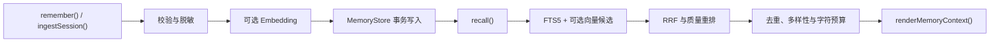

# @yiku/memories

`@yiku/memories` 为 Agent 提供持久、分域、可解释的长期记忆。

## 读写流程



## 核心能力

- 必需的 Namespace 隔离，以及可选的 User、Agent、Project 和 Session Scope。
- 将持久化 Kind 投影为 Scenario、Procedure、Semantic 三类可解释记忆。
- 基于 WAL、FTS5、Schema 版本和向量 BLOB 的事务型 SQLite 持久化。
- 与 SQLite Store 行为契约一致的内存 Store。
- 词法检索，以及可选的 Embedding 混合检索。
- 确定性的倒数排名融合和可解释分数。
- 通过供应商无关的 `MemoryExtractor` 提取结构化会话记忆。
- Secret 脱敏、内容限制、TTL、软删除、硬删除和清理。
- 幂等写入和乐观 Revision 检查。
- 面向 Agent Instructions 的安全、有界上下文渲染。
- 结构化事件和稳定的类型化错误。

本包要求 Node.js `>=22.13.0`。Node 22 中的 `node:sqlite` 可能输出实验性警告。

## 基本使用

```ts
import {
  MemoryManager,
  SqliteMemoryStore,
} from "@yiku/memories";

const manager = new MemoryManager({
  store: new SqliteMemoryStore({
    filePath: "/absolute/path/to/memories.sqlite",
  }),
});

await manager.remember({
  context: {
    namespace: "tenant-1",
    scope: {
      projectId: "project-1",
      userId: "user-1",
    },
  },
  kind: "preference",
  content: "Prefer concise engineering explanations.",
  confidence: 0.95,
  importance: 0.8,
});

const recalled = await manager.recall({
  context: {
    namespace: "tenant-1",
    scope: {
      projectId: "project-1",
      userId: "user-1",
    },
  },
  query: "How should responses be written?",
});

await manager.close();
```

未提供 `EmbeddingProvider` 时，Recall 使用 SQLite FTS5。注入 Provider 后即可启用混合检索，
不需要修改持久化 API。

## 记忆分类

Memory Store 继续使用兼容的五种 `MemoryKind`。Recall 在重排后把结果投影为三类运行时原子：

| 分类 | 持久化 Kind | 含义 |
| --- | --- | --- |
| `scenario` | `decision`、`episode` | 与具体场景、经历和决策上下文相关的记忆 |
| `procedure` | `procedure` | 可重复执行的步骤、方法和操作知识 |
| `semantic` | `fact`、`preference` | 事实、概念和稳定偏好 |

分类原子只增加可解释的运行时观测，不改变 SQLite Schema、指纹和查询过滤语义。

## 主要导出

- `MEMORY_ATOMS`
- `MEMORY_CLASS_ATOMS`
- `MEMORY_ATOM_DEFINITIONS`
- `memoryClassForKind`
- `MemoryManager`
- `SqliteMemoryStore`
- `InMemoryMemoryStore`
- `DefaultMemoryPolicy`
- `DefaultMemoryReranker`
- `renderMemoryContext`
- `MemoryStore`
- `MemoryExtractor`
- `EmbeddingProvider`
- `MemoryRedactor`
- 类型化 Memory 错误和操作事件

## Orchestrator 集成

`@yiku/agent-orchestrator` 的 `runAgentSession()` 接受可选的 `memories` 配置。Recall 在
Agent 构建前执行；只有显式启用 Extraction 时，合格输出才会被提取。启用工业 Evals 后仅
`accepted` 输出自动晋升长期 Memory。

参见 [Memories](../../docs/features/memories.md)。

## 验证

```bash
corepack pnpm --filter @yiku/memories build
corepack pnpm --filter @yiku/memories test
```

## 相关文档

- [Memories](../../docs/features/memories.md)
- [Runtime 与编排](../../docs/architecture/runtime-and-orchestration.md)
- [Context Compact](../../docs/features/context-compaction.md)
- [Evals](../../docs/features/evaluations.md)
