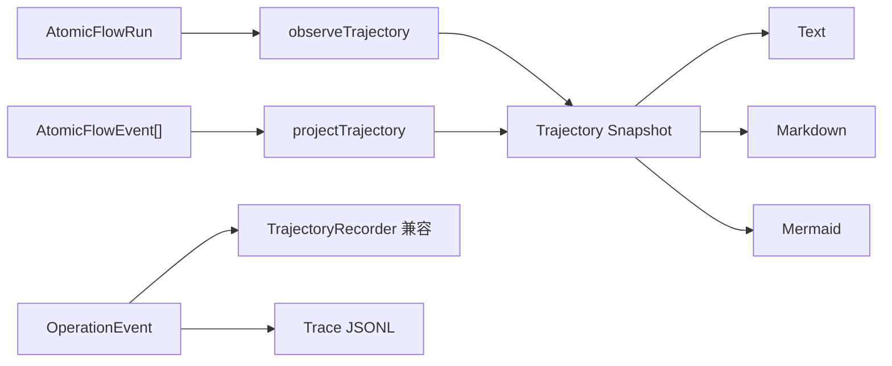

# @yiku/trajectory

`@yiku/trajectory` 负责从 Atomic Flow 投影和渲染 Agent 执行轨迹，并提供兼容的 JSONL Trace
记录器。标准 Agent Run 以 Atomic Flow 为唯一事实源；`OperationEvent` Recorder 和
`AtomicTrajectorySink` 继续作为兼容入口。

## 数据流



## 主要导出

- `AtomicTrajectorySink`
- `AtomicTrajectoryProjection`
- `projectTrajectory`
- `observeTrajectory`
- `TRAJECTORY_ATOMS`
- `TRAJECTORY_ATOM_DEFINITIONS`
- `TrajectoryRecorder`
- `Trace`
- `readTraceEntries`
- `renderTrajectoryText`
- `renderTrajectoryMarkdown`
- `renderTrajectoryMermaid`

## 使用示例

```ts
import { projectTrajectory, renderTrajectoryText } from "@yiku/trajectory";

const trajectory = projectTrajectory(atomicFlow.snapshot().events);

console.log(renderTrajectoryText(trajectory));
```

浏览器端从 `@yiku/trajectory/browser` 导入 `projectTrajectory`，该出口不会包含 Node 文件系统
Trace 实现。`throughSequence` 可投影任意 Replay 前缀；内部 Trace/Trajectory Receipt 默认不
进入用户轨迹。

`Trace` 以追加方式写入 JSONL。持久化失败不会中断 Agent 会话，读取不存在或损坏的 Trace
时返回空列表。

`AtomicTrajectorySink` 仍可供旧宿主生成 `trajectory.project` 回执，但标准 Orchestrator
不再挂载它。Agent Observatory 直接从同一 Atomic Flow 前缀生成 Topology 和 Trajectory。

## 验证

```bash
corepack pnpm --filter @yiku/trajectory build
corepack pnpm --filter @yiku/trajectory test
```

## 相关文档

- [Trajectory](../../docs/atoms/trajectory.md)
- [Atomic Flow](../../docs/atoms/atomic-flow.md)
