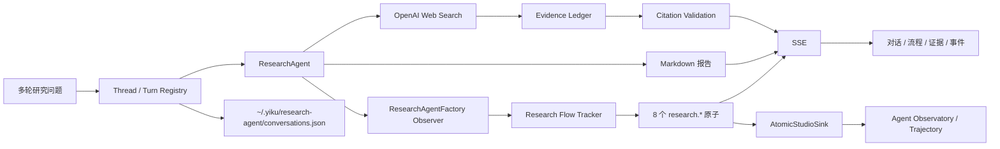

# Research Agent 对话工作区

Research Agent 对话工作区是独立于 `yiku web` 和 Agent Studio 的本地页面。Node Server 默认调用
`@yiku/agent-research`，React Frontend 通过 Thread/Turn API 发起多轮研究，并通过 SSE 实时接收
Agent Progress、Research Atomic Flow 和运行状态。

## 数据流



Research Runner 发射：

```text
research.plan
research.query
research.search
research.evidence-record
research.corroborate
research.synthesize
research.citation-validate
research.report
```

页面直接折叠这些领域原子，不再从通用 Tool 事件推断研究阶段。
Research Runner 只负责配置、Conversation Prompt 和宿主结果；Tracker、Evidence 订阅和报告
验证由标准 Factory Observer 完成。Turn ID 同时作为 Observatory Run ID，页面可以从当前
Research Turn 直接打开同一事件流投影出的 Trajectory。

## 环境配置

Research Playground 与 CLI 使用相同的配置合并顺序，后者覆盖前者：

1. `~/.yiku/.env`
2. 启动进程环境变量
3. 当前工作区 `.env`

从仓库根目录执行 `pnpm --filter` 时，Playground 会通过 `INIT_CWD` 识别该工作区，不需要在
`playground/research-agent` 下重复创建 `.env`。最小配置为：

```bash
AI_MODEL=your-model-key
OPENAI_API_KEY=your-api-key
```

模型定义会合并 `~/.yiku/config.yaml` 与工作区 `config.yaml`，项目配置优先。目标模型和
Provider 必须支持 Responses API Web Search。

可选配置：

```bash
AI_MODEL_NAME=gpt-5-mini
OPENAI_BASE_URL=https://api.openai.com/v1
AI_RESEARCH_AGENT_NAME=Yiku Research Agent
# AI_SEARCH_CONTEXT_SIZE=medium
YIKU_RESEARCHER_API_PORT=4328
# YIKU_RESEARCHER_DATA_FILE=/absolute/path/to/conversations.json
```

`AI_SEARCH_CONTEXT_SIZE` 只接受 `low`、`medium` 或 `high`。默认不发送
`search_context_size`，以兼容不支持该扩展字段的 OpenAI 兼容 Provider；确认 Provider 支持后再
显式配置。

`YIKU_RESEARCHER_DATA_FILE` 可覆盖会话文件位置，必须使用绝对路径；未配置时仍写入
`~/.yiku/research-agent/conversations.json`。

Trae Workspace Sandbox 不允许其长生命周期子进程写入 Home。`dev` 检测到该环境且未显式配置
`YIKU_RESEARCHER_DATA_FILE` 时，会改用
`$TMPDIR/yiku-research-agent-<uid>/conversations.json`，首次使用时复制现有 Home 会话。该回退
仅用于本地预览，内容不会自动同步回 Home；需要持久化到其他位置时应显式配置可写绝对路径。

## 启动

从仓库根目录运行：

```bash
corepack pnpm --filter @yiku/research-agent-playground dev
```

- Frontend：`http://127.0.0.1:4327`
- Server：`http://127.0.0.1:4328`
- Observatory Frontend：`http://127.0.0.1:4317`
- Observatory Server：`http://127.0.0.1:4318`

`dev` 命令会同时管理 Research 与 Observatory 的 Web/API 进程，任一必需进程异常退出时会关闭
其余子进程。

## API

| Endpoint | 作用 |
| --- | --- |
| `GET /api/health` | 健康检查 |
| `GET /api/observatory` | 查询本地 Observatory 可用性和入口 |
| `GET /api/threads` | 列出研究会话 |
| `POST /api/threads` | 创建研究会话 |
| `GET /api/threads/:threadId` | 获取消息和 Turn 快照 |
| `DELETE /api/threads/:threadId` | 中止并删除研究会话 |
| `POST /api/threads/:threadId/messages` | 提交下一轮研究 |
| `GET /api/turns/:turnId` | 获取单轮快照 |
| `GET /api/turns/:turnId/events` | 从指定 Event ID 订阅 SSE |
| `POST /api/turns/:turnId/cancel` | 幂等取消活动 Turn |

## 页面设置

页面右上角设置按钮或 `Command/Ctrl + K` 可打开 Research 设置：

- Agent：设置回答风格和所有后续 Turn 共用的自定义指令；
- Skills：启停内置 Skill，或基于 Quick/Research/Deep 模式创建本地自定义 Skill；
- 来源：覆盖单轮 `search_context_size`，并控制是否优先主要来源；
- 快捷键：在 `Enter` 和 `Command/Ctrl + Enter` 两种发送方式间切换。

设置保存在浏览器 `localStorage`。自定义 Skill 保存名称、说明、基础模式和执行指令；提交时仍使用
服务端支持的基础模式，并将自定义指令作为当前 Turn 的执行选项发送。
`POST /api/threads/:threadId/messages` 因此还接受可选的 `instructions` 和
`searchContextSize` 字段。

旧 `/api/runs` 接口只保留兼容，不再由新页面调用。

Thread、Message、Turn、Evidence 和事件写入
`~/.yiku/research-agent/conversations.json`。Store 使用私有权限、临时文件和原子 Rename；
目录与文件权限分别修复为 `0700` 和 `0600`。服务重启后恢复已完成历史，未完成 Turn 标记为
失败并保留诊断。Trae Sandbox 下的本地预览回退位置见上文。

Server 只绑定回环地址，不提供认证、多租户或远程部署边界。

## 验证

```bash
corepack pnpm --filter @yiku/research-agent-playground typecheck
corepack pnpm --filter @yiku/research-agent-playground build
corepack pnpm --filter @yiku/research-agent-playground lint
```

真实 Web Search 功能验证需要有效模型配置和网络。

## 相关文档

- [Research Agent](../../docs/features/research-agent.md)
- [Evals](../../docs/features/evaluations.md)
- [Atomic Flow](../../docs/atoms/atomic-flow.md)
